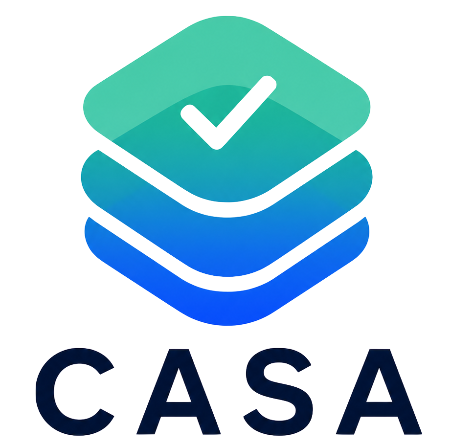
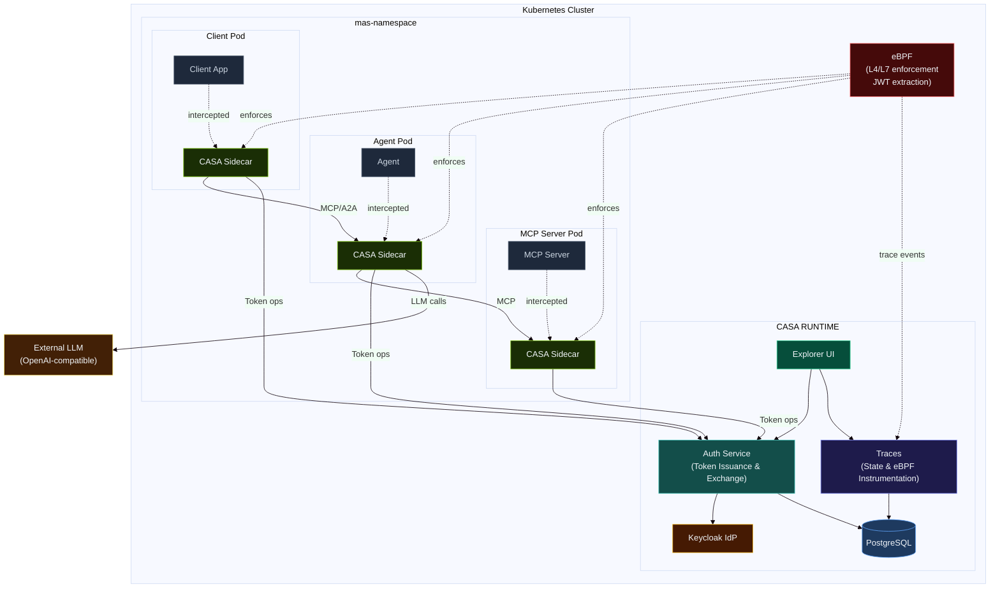
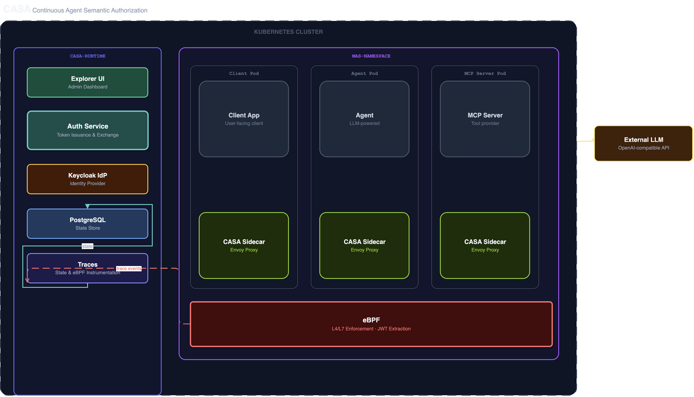
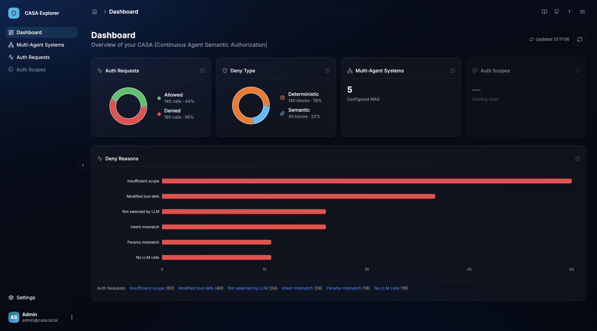
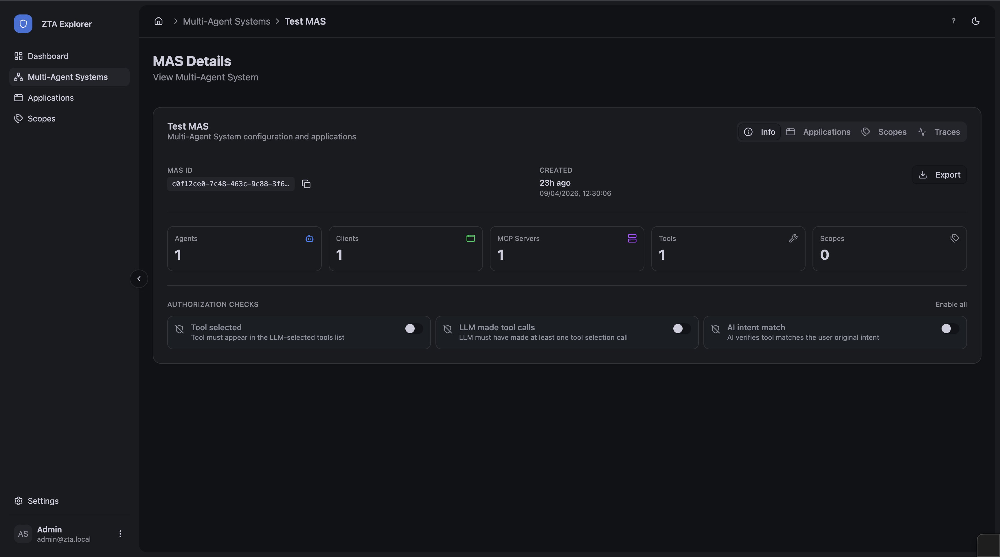
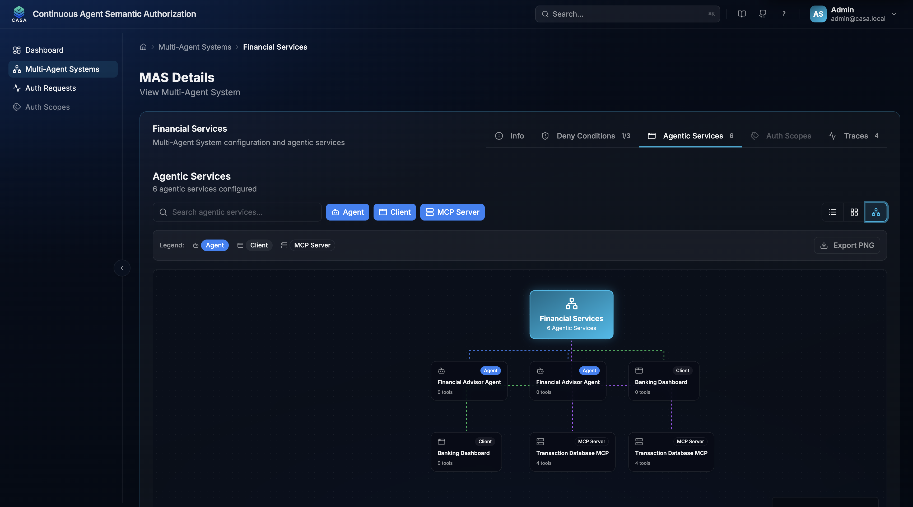
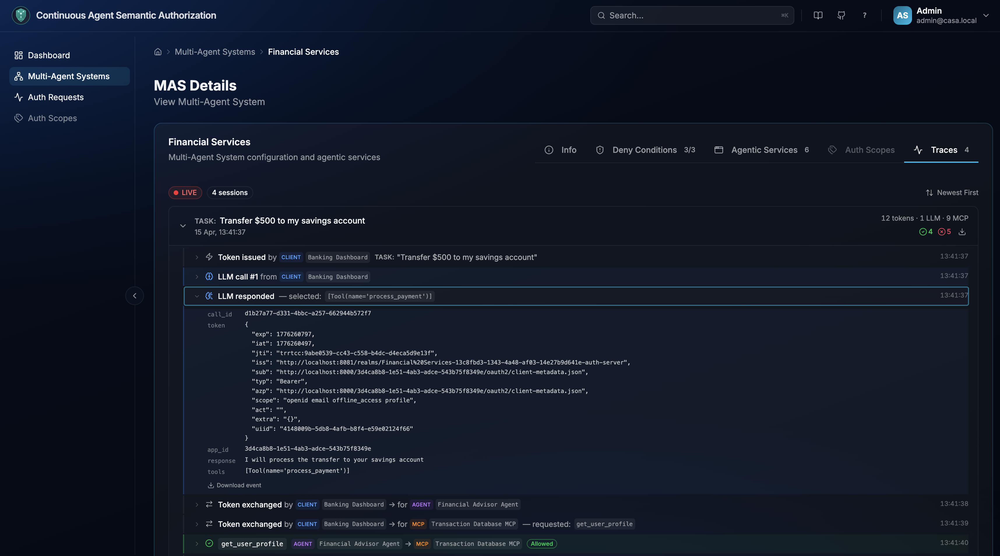

<div align="center">
  <picture>
    <source media="(prefers-color-scheme: dark)" srcset="docs/ui/static/img/logo-white.png" width="128">
    
  </picture>

  <h1>Continuous Agent Semantic Authorization</h1>

  <h2>CASA checks every agent tool call against the user’s original intent before the tool runs.</h2>

  <p>
    <strong>Intent-scoped authorization for Kubernetes Multi-Agent Systems —<br/>
    enforced at the network layer, with no code changes required in your agents.</strong>
  </p>

  <br/>

  <p>
    <a href="../../actions/workflows/pytest.yml"></a>
    <a href="../../actions/workflows/pre-commit.yml"></a>
    <a href="../../actions/workflows/docs.yml"></a>
    <a href="../../releases"></a>
    <a href="https://opensource.org/licenses/Apache-2.0"></a>
  </p>

  <p>
    <a href="https://kubernetes.io/"></a>
    <a href="https://helm.sh/"></a>
    <a href="https://istio.io/"></a>
    <a href="https://cilium.io/"></a>
    <a href="https://www.keycloak.org/"></a>
  </p>
</div>

---

## Why CASA

Modern AI applications are increasingly composed of agents, MCP servers, and orchestration layers that collaborate autonomously. Standard identity solutions were not built for this: they assume human users, static roles, and predictable access patterns. An agent that has been granted access to a tool can use that tool for anything — regardless of what the user actually asked for.

CASA addresses this by introducing **intent-scoped authorization**: every tool call made by an agent must be validated against the original user intent. If an agent tries to invoke a filesystem write tool when the user only asked for a balance summary, CASA blocks it — at the network level, before the tool executes.

Enforcement happens through sidecars injected into each MAS pod and an eBPF-based network layer, both orchestrated by the CASA runtime. MAS applications are configured through Kubernetes CRDs and require no SDK integration or code modifications.

---

## Architecture

### Global



### Components



| Component        | Description                                                                                                      |
| ---------------- | ---------------------------------------------------------------------------------------------------------------- |
| **Auth Service** | Issues identities (Client Id Metadata based); Issues and exchanges OAuth2 tokens; runs tool authorization checks |
| **CASA Sidecar** | Envoy-based proxy injected into every MAS pod; intercepts all traffic                                            |
| **eBPF layer**   | eBPF enforces deny-by-default network policies and extracts JWTs for observability                               |
| **Keycloak**     | Identity provider backing token cryptography                                                                     |
| **Traces**       | Persists domain event traces and eBPF flow data; exposes query API for the Explorer UI                           |
| **Explorer UI**  | Read-only observability UI for browsing token events, tool decisions, and authorization traces                   |

---

## Explorer UI

The Explorer UI is a read-only observability UI for browsing token events, tool check decisions, and authorization traces.

### Dashboard

Overview of all configured Multi-Agent Systems, application counts, tool call decisions (approved vs. blocked), and block reasons.



### MAS Details — Info

Per-MAS configuration: MAS ID, registered agents/clients/MCP servers, scopes, and enabled authorization checks.



### MAS Details — Applications

Interactive graph view of the applications within a MAS (agents, clients, MCP servers) and their relationships.



### MAS Details — Traces

Token-level trace for each user session: token issuance, LLM selection events, and per-tool ALLOW/BLOCK decisions with check details.



---

## Core Concepts

**Runtime** — The CASA runtime (`casa-runtime` namespace) handles agent identity (CIMD - Client ID Metadata), token issuance, token exchange, tool check orchestration, and MAS lifecycle management. It is deployed as a Helm chart.

**Multi-Agent System (MAS)** — A named group of applications (agents, MCP servers, and clients) that interact with each other inside a Kubernetes namespace. Each MAS is described by a `MultiAgentSystem` CRD.

**CASA Sidecar** — An Envoy-based proxy automatically injected into every pod in a CASA-enabled namespace. It intercepts inbound and outbound HTTP traffic, injects tokens on egress, and validates tokens on ingress — without any changes to the application.

**MultiAgentSystem CRD** — Declares the applications in a MAS and which tool authorization checks are enabled for the system.

**Deterministic Checks** — Rule-based validations that verify whether a requested tool was: (1) present in the token's allowed tool list, and (2) among the tools the LLM actually selected. Fast, no AI required.

**Semantic Checks** — AI-powered validation that matches the requested tool against the original user intent using embeddings or an LLM verifier. Catches cases where an agent requests a tool that is technically allowed but does not match what the user asked for.

---

## Quick Start

### Prerequisites

- Kubernetes cluster (kind, EKS, GKE, or AKS)
- `kubectl` and `helm` installed
- One of: Istio (v1.17+) or Cilium (v1.14+) installed in your cluster

> Note: Currently only Istio is supported. Cilium support is on the roadmap.

### 1. Install the CASA Runtime

```bash
helm install casa deployments/helm/casa-runtime \
  --namespace casa-runtime \
  --create-namespace
```

Wait for all pods to be ready:

```bash
kubectl -n casa-runtime wait --for=condition=ready pod --all --timeout=300s
```

### 2. Install the Demo MAS

The demo MAS uses the following `MultiAgentSystem` CRD spec:

```yaml
apiVersion: casa.io/v1alpha1
kind: MultiAgentSystem
metadata:
    name: my-mas
    namespace: my-mas
spec:
    name: "My Multi-Agent System"
    enabledToolChecks:
        - DETERMINISTIC_TOOL_SELECTED
        - DETERMINISTIC_LLM_SELECTED_TOOLS
    llm_host: your-llm-host.example.com
    apps:
        - name: my-agent
          type: agent
          kubernetesWorkloadName: my-agent
          baseUrl:
              host: my-agent:8000
              scheme: http
          httpRequestSchema:
              promptFieldJsonPath: "{.prompt}"
        - name: my-mcp-server
          type: mcp_server
          kubernetesWorkloadName: my-mcp-server
          baseUrl:
              host: my-mcp-server:8080
              scheme: http
```

To explore CASA with the demo MAS, install it with Helm:

```bash
# Edit demo/helm/values.yaml to add your OpenAI-compatible API key
helm install casa-mas demo/helm/ \
  --namespace casa-sidecar \
  --create-namespace
```

### 3. Enable Sidecar Injection

**Istio mode:**

```bash
kubectl label namespace my-mas istio-injection=enabled
```

**Cilium mode:** (Not yet supported, coming soon)

```bash
kubectl label namespace my-mas casa.io/injection=enabled
```

### 4. Verify

```bash
# Check runtime health
kubectl -n casa-runtime get pods

# Test token issuance
kubectl -n casa-runtime port-forward svc/casa-auth-service 8000:8000 &
curl http://localhost:8000/health
```

For a complete walkthrough including demo output, see the [Demo Walkthrough](docs/ui/docs/demo/walkthrough.md).

### Local Standalone Setup (Minikube)

`scripts/dev/local-setup-standalone.sh` bootstraps a full CASA stack on a local Minikube cluster — control plane, sidecars, demo agents, and all UIs — in a single command. No external YAML files are needed; all Helm values are inlined in the script.

**Prerequisites:** `minikube`, `istioctl`, `helm`, `kubectl`, `docker`, `crane`

```bash
brew install minikube istioctl helm kubectl crane
```

Export the required env vars before running:

```bash
export CASA_LLM_HOST=your-llm-host.example.com   # OpenAI-compatible API hostname
export CASA_LLM_API_KEY=your-api-key             # API key for the LLM service

# Optional — override model defaults
export CASA_LLM_MODEL_ID=bedrock/global.anthropic.claude-sonnet-4-6
export CASA_PIPELINE_MODEL_ID=azure/gpt-4o
```

Then run:

```bash
bash scripts/dev/local-setup-standalone.sh          # install / upgrade
bash scripts/dev/local-setup-standalone.sh reset    # wipe data and reinstall
```

For full details see the [Developer — Local Standalone Setup](docs/ui/docs/dev/local-setup.md) doc.

---

## Repository Structure

| Path                             | Description                                         |
| -------------------------------- | --------------------------------------------------- |
| `deployments/helm/casa-runtime/` | CASA runtime Helm chart                             |
| `demo/helm/`                     | Demo MAS Helm chart (agent + MCP server)            |
| `demo/src/agent-safe/`           | Demo safe agent source code                         |
| `demo/src/agent-compromised/`    | Demo compromised agent source code                  |
| `demo/src/mcp/`                  | Demo MCP server source code                         |
| `sidecar/`                       | Sidecar elements (ext_auth, llm_proxy)              |
| `src/casa_auth_server/`          | Auth service Python source                          |
| `casa-explorer-ui/`              | Explorer UI source (React, read-only observability) |
| `docs/ui/`                       | Docusaurus documentation portal                     |
| `docs/dev`                       | Architecture specs and design documents             |

---

## Project Status

**Alpha / PoC** — CASA is under active development. The current Helm chart (`v0.1.5`) deploys a monolithic auth service suitable for development and proof-of-concept use.

The CRD API version is `v1alpha1` and field-level changes are possible before a stable release.

---

## Contributing

Contributions are welcome. Please read the [Contributing Guide](docs/ui/docs/contributing/contributing.md) before opening a pull request.

For local development setup, see [Developer Notes](docs/dev/Developer_notes.md).

---

## License

Apache 2.0. See [LICENSE](LICENSE).

---

## Security

If you discover a security vulnerability, please do not open a public issue. Contact the maintainers directly via the repository security advisory process.
