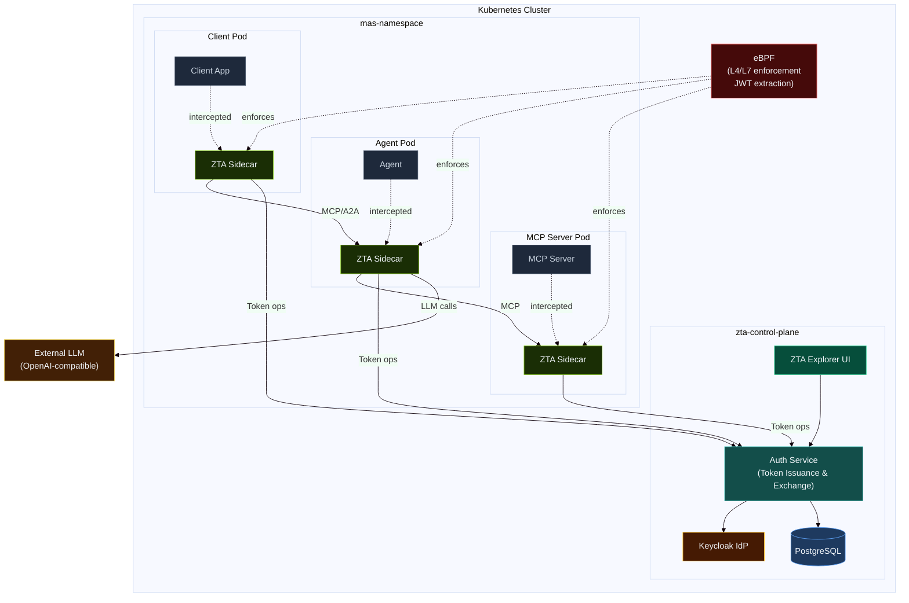

[](https://github.com/cisco-eti/identity-auth-server/actions/workflows/pytest.yml) [](https://github.com/cisco-eti/identity-auth-server/actions/workflows/pre-commit.yml)

# ZTA — Zero Trust for Multi-Agent Systems

A cloud-native Kubernetes platform that enforces Zero Trust authorization for Multi-Agent Systems (MAS) — with no code changes required in the agents themselves.

---

## Why ZTA

Modern AI applications are increasingly composed of agents, MCP servers, and orchestration layers that collaborate autonomously. Standard identity solutions were not built for this: they assume human users, static roles, and predictable access patterns. An agent that has been granted access to a tool can use that tool for anything — regardless of what the user actually asked for.

ZTA addresses this by introducing **intent-scoped authorization**: every tool call made by an agent must be validated against the original user intent. If an agent tries to invoke a filesystem write tool when the user only asked for a balance summary, ZTA blocks it — at the network level, before the tool executes.

Enforcement happens through sidecars injected into each MAS pod and an eBPF-based network layer, both orchestrated by the ZTA control plane. MAS applications are configured through Kubernetes CRDs and require no SDK integration or code modifications.

---

## Architecture

### Global



### Components


| Component           | Description                                                                                                      |
| ------------------- | ---------------------------------------------------------------------------------------------------------------- |
| **Auth Service**    | Issues identities (Client Id Metadata based); Issues and exchanges OAuth2 tokens; runs tool authorization checks |
| **ZTA Sidecar**     | Envoy-based proxy injected into every MAS pod; intercepts all traffic                                            |
| **eBPF layer**      | eBPF enforces deny-by-default network policies and extracts JWTs for observability                               |
| **Keycloak**        | Identity provider backing token cryptography                                                                     |
| **ZTA Explorer UI** | Read-only observability UI for browsing token events, tool decisions, and authorization traces                    |

---

## ZTA Explorer UI

The ZTA Explorer UI is a read-only observability UI for browsing token events, tool check decisions, and authorization traces.

### Dashboard

Overview of all configured Multi-Agent Systems, application counts, tool call decisions (approved vs. blocked), and block reasons.


### MAS Details — Info

Per-MAS configuration: MAS ID, registered agents/clients/MCP servers, scopes, and enabled authorization checks.


### MAS Details — Applications

Interactive graph view of the applications within a MAS (agents, clients, MCP servers) and their relationships.


### MAS Details — Traces

Token-level trace for each user session: token issuance, LLM selection events, and per-tool ALLOW/BLOCK decisions with check details.


---

## Core Concepts

**Control Plane** — The ZTA control plane (`zta-control-plane` namespace) handles agent identity (CIMD - Client Id Metadata), token issuance, token exchange, tool check orchestration, and MAS lifecycle management. It is deployed as a Helm chart.

**Multi-Agent System (MAS)** — A named group of applications (agents, MCP servers, and clients) that interact with each other inside a Kubernetes namespace. Each MAS is described by a `MultiAgentSystem` CRD.

**ZTA Sidecar** — An Envoy-based proxy automatically injected into every pod in a ZTA-enabled namespace. It intercepts inbound and outbound HTTP traffic, injects tokens on egress, and validates tokens on ingress — without any changes to the application.

**MultiAgentSystem CRD** — Declares the applications in a MAS and which tool authorization checks are enabled for the system.

**Deterministic Checks** — Rule-based validations that verify whether a requested tool was: (1) present in the token's allowed tool list, and (2) among the tools the LLM actually selected. Fast, no AI required.

**Semantic Checks** — AI-powered validation that matches the requested tool against the original user intent using embeddings or an LLM verifier. Catches cases where an agent requests a tool that is technically allowed but does not match what the user asked for.

---

## Quick Start

### Prerequisites

- Kubernetes cluster (kind, EKS, GKE, or AKS)
- `kubectl` and `helm` installed
- One of: Istio (v1.17+) or Cilium (v1.14+) installed in your cluster

> Note: Currently only Istio is supported. Cilium support is on the roadmap.

### 1. Install the ZTA Control Plane

```bash
helm install zta deployments/k8s/helm/zta-control-plane \
  --namespace zta-control-plane \
  --create-namespace
```

Wait for all pods to be ready:

```bash
kubectl -n zta-control-plane wait --for=condition=ready pod --all --timeout=300s
```

### 2. Install the Demo MAS

The demo MAS uses the following `MultiAgentSystem` CRD spec:

```yaml
apiVersion: zta.io/v1alpha1
kind: MultiAgentSystem
metadata:
    name: my-mas
    namespace: my-mas
spec:
    name: "My Multi-Agent System"
    authorizationServer: "my-mas-realm"
    enabledToolChecks:
        - DETERMINISTIC_TOOL_SELECTED
        - DETERMINISTIC_LLM_SELECTED_TOOLS
    apps:
        - name: my-agent
          type: agent
          baseUrl: "http://my-agent.my-mas.svc.cluster.local:8000"
        - name: my-mcp-server
          type: mcp_server
          baseUrl: "http://my-mcp-server.my-mas.svc.cluster.local:8080"
```

To explore ZTA with the demo MAS, install it with Helm:

```bash
# Edit demo/k8s/helm/values.yaml to add your OpenAI-compatible API key
helm install zta-mas demo/k8s/helm/ \
  --namespace zta-sidecar \
  --create-namespace
```

### 3. Enable Sidecar Injection

**Istio mode:**

```bash
kubectl label namespace my-mas istio-injection=enabled
```

**Cilium mode:** (Not yet supported, coming soon)

```bash
kubectl label namespace my-mas zta.io/injection=enabled
```

### 4. Verify

```bash
# Check control plane health
kubectl -n zta-control-plane get pods

# Test token issuance
kubectl -n zta-control-plane port-forward svc/zta-auth-service 8000:8000 &
curl http://localhost:8000/health
```

For a complete walkthrough including demo output, see the [Demo Walkthrough](docs/ui/docs/demo/walkthrough.md).

---

## Repository Structure

| Path                                      | Description                              |
| ----------------------------------------- | ---------------------------------------- |
| `deployments/k8s/helm/zta-control-plane/` | ZTA control plane Helm chart             |
| `deployments/k8s/crds/`                   | CRD examples and API reference           |
| `demo/k8s/helm/`                          | Demo MAS Helm chart (agent + MCP server) |
| `demo/src/agent/`                         | Demo agent source code                   |
| `demo/src/mcp/`                           | Demo MCP server source code              |
| `ext_authz_middleware/`                   | Istio ext-authz middleware (Go)          |
| `src/identity_auth_server/`               | Auth service Python source               |
| `zta-explorer-ui/`                        | ZTA Explorer UI source (React, read-only observability) |
| `docs/ui/`                                | Docusaurus documentation portal          |
| `contrib/wip/it1/`                        | Architecture specs and design documents  |

---

## Project Status

**Alpha / PoC** — ZTA is under active development. The current Helm chart (`v0.1.5`) deploys a monolithic auth service suitable for development and proof-of-concept use. The production architecture (microservices decomposition, HA, Redis caching, AI pipeline service) is defined in `contrib/wip/it1/SPECS.md` and is on the roadmap.

The CRD API version is `v1alpha1` and field-level changes are possible before a stable release.

---

## Contributing

Contributions are welcome. Please read the [Contributing Guide](docs/ui/docs/contributing/contributing.md) before opening a pull request.

For local development setup, see [Developer Notes](docs/dev/Developer_notes.md).

---

## License

Apache 2.0. See [LICENSE](LICENSE).

---

## Security

If you discover a security vulnerability, please do not open a public issue. Contact the maintainers directly via the repository security advisory process.
