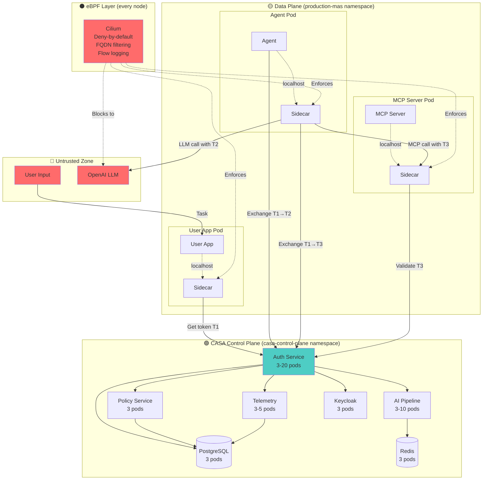
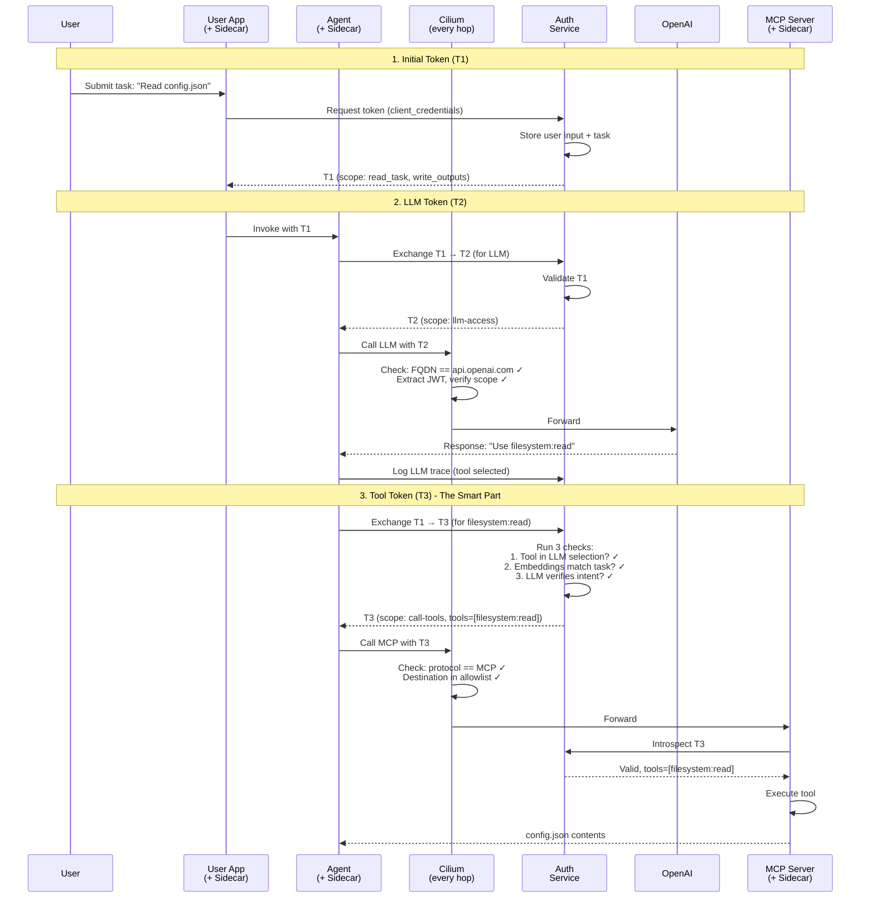
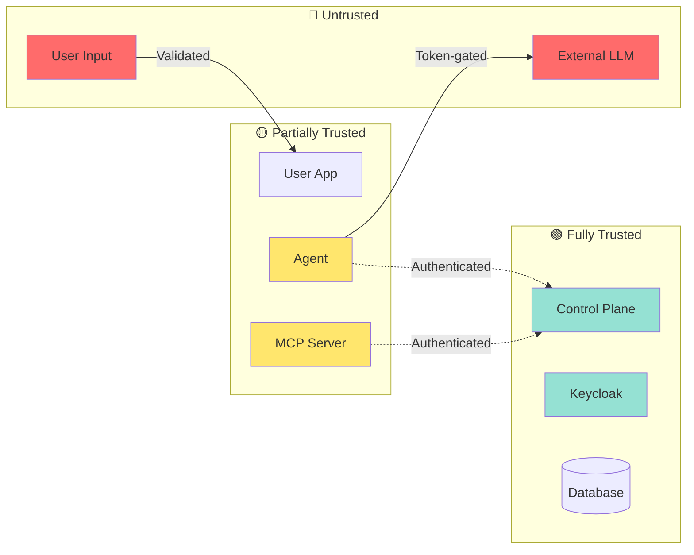

# Zero Trust Multi-Agent System - Kubernetes Deployment Guide

**Purpose:** Minimum information needed to design and deploy a Zero Trust Authorization System for Multi-Agent Systems in Kubernetes.

**What this guide covers:**
1. System components (control plane + data plane)
2. Token flow (how auth actually works)
3. Responsibility model (eBPF vs Sidecar vs Control Plane)
4. Network policy (deny-by-default with Cilium)
5. Packaging (Helm + CRDs + Operators)
6. Deployment architecture (namespaces, services, infrastructure)
7. Security enforcement (threat → mitigation mapping)
8. Operations (scaling, observability, GitOps)
9. Implementation roadmap (5 phases, 20 weeks)
10. Design decisions (ADRs with tradeoffs)

**Time to read:** 15 minutes | **Full spec:** [SPECS.md](./SPECS.md) (11,000 lines)

---

## What You're Building

A production-ready Kubernetes deployment of a Zero Trust Authorization System for Multi-Agent Systems. This system secures AI agents that call LLMs and execute tools through MCP servers.

**Architecture in 30 seconds:**
- **Sidecar pattern**: Envoy proxy injected into every pod (agents, MCP servers, user apps)
- **Network enforcement**: Cilium eBPF enforces deny-by-default at L3/L4
- **Token-based auth**: JWT tokens issued by control plane, validated at multiple layers
- **Protocol restrictions**: Only MCP and A2A protocols internally; single LLM endpoint externally
- **Defense in depth**: eBPF → Sidecar → Control Plane, each validates independently

**Key insight:** The sidecar intercepts ALL traffic, eBPF blocks at kernel level, control plane makes AI-powered authorization decisions.

### System Architecture (One Diagram to Rule Them All)



**Read this diagram:**
- 🔴 Red = Untrusted (user input, external LLM)
- 🟡 Yellow = Partially trusted (your workloads with sidecars)
- 🟢 Green = Fully trusted (control plane)
- ⚫ Black/Red = Enforcement layer (eBPF blocks at kernel)

**Critical paths:**
1. **Token acquisition:** User App → Auth Service → Keycloak
2. **Token exchange:** Agent → Auth Service → AI Pipeline (verify tool)
3. **Enforcement:** eBPF blocks ALL traffic not explicitly allowed

---

## Step 1: Understand the Components

### Control Plane (namespace: `casa-control-plane`)
The brains of the operation. Runs as stateless services (except PostgreSQL).

| Service | What It Does | Scale |
|---------|-------------|-------|
| **Auth Service** | Issues JWT tokens, exchanges them (RFC 8693), validates | 3-20 pods (HPA) |
| **Policy Service** | Manages MAS configs, app registrations, tool definitions | 3 pods |
| **AI Pipeline Service** | Matches tools to tasks using embeddings + LLM verification | 3-10 pods (HPA) |
| **Telemetry Service** | Collects and stores audit events (token usage, LLM calls) | 3-5 pods (HPA) |
| **Keycloak** | OAuth2 IdP (token signing, realm management) | 3 pods (HA) |
| **PostgreSQL** | Stores everything (apps, MAS, tokens, events) | 3 pods (HA) |
| **Redis** | Caches tokens, embeddings | 3 pods (Sentinel) |

**Critical path:** User App → Auth Service → Keycloak → Token → Agent → Auth Service (exchange) → AI Pipeline (verify tool) → Token → MCP Server

📖 **Detailed APIs:** [SPECS.md §3](./SPECS.md#3-component-decomposition)

### Data Plane (namespace: per-MAS, e.g., `production-mas`)
Your actual workloads. Every pod gets a sidecar injected automatically.

**Pod structure:**
```
┌─────────────────────────────┐
│  Agent Pod                  │
│  ┌────────────────────────┐ │
│  │ Agent Container        │ │
│  │ (your code)            │ │
│  └───────┬────────────────┘ │
│          │ localhost:8080   │
│  ┌───────▼────────────────┐ │
│  │ Envoy Sidecar          │ │
│  │ • Intercepts traffic   │ │
│  │ • Injects tokens       │ │
│  │ • Validates protocol   │ │
│  └────────────────────────┘ │
└─────────────────────────────┘
```

**Sidecar responsibilities:**
- Intercept ALL pod traffic (iptables redirect)
- Request/cache tokens from control plane
- Inject `Authorization: Bearer <token>` headers
- Validate L7 protocol (only MCP/A2A allowed)
- Log requests to telemetry

📖 **Envoy config:** [SPECS.md §4.3](./SPECS.md#43-sidecar-architecture-envoy-proxy)

### eBPF Layer (Cilium)
Kernel-level enforcement. Runs on every node.

**What eBPF does:**
- **Deny-by-default**: Block all traffic unless explicitly allowed
- **Identity-aware policies**: Use pod labels, not IP addresses
- **FQDN filtering**: Only `api.openai.com` allowed for LLM calls
- **Token extraction**: Parse JWT from HTTP headers (optional, for logging)
- **Flow logging**: Hubble observability

**Key point:** eBPF blocks at L3/L4 (TCP), sidecar validates at L7 (MCP/A2A protocols).

📖 **Policy examples:** [SPECS.md §5](./SPECS.md#5-network-architecture--policy-enforcement)

---

## Step 2: How Tokens Flow (The Critical Path)

This is the most important flow to understand. Everything else supports this.

### The Journey of a Token



### Token Types Explained

| Token | Scope | Lifetime | Who Uses It | Why |
|-------|-------|----------|-------------|-----|
| **T1** (Initial) | `read_task`, `write_outputs` | 1 hour | User App → Agent | User's original token, delegates to agent |
| **T2** (LLM) | `llm-access` | 15 min | Agent → LLM | Restricted: ONLY for LLM calls, logged |
| **T3** (Tool) | `call-tools`, `tools=[...]` | 5 min | Agent → MCP | Most restrictive: specific tools only |

**Key insight:** Token exchange happens at sidecar, validation at control plane, enforcement at eBPF. Defense in depth.

📖 **Full sequence:** [SPECS.md §2.3](./SPECS.md#23-data-flow-sequence-token-acquisition-to-tool-execution)
---

## Step 3: Who Does What (Responsibility Matrix)

Understanding the division of labor prevents design mistakes.

| Security Function | eBPF (L3/L4) | Sidecar (L7) | Control Plane |
|-------------------|--------------|--------------|---------------|
| **Network blocking** | ✅ Deny-by-default | ❌ | ❌ |
| **Protocol validation** | ⚠️ See TCP only | ✅ Parse MCP/A2A | ❌ |
| **Token acquisition** | ❌ | ✅ Request from control plane | ✅ Issue tokens |
| **Token injection** | ❌ | ✅ Add to headers | ❌ |
| **Token validation** | ⚠️ Basic checks | ✅ Full JWT decode | ✅ Introspection |
| **FQDN filtering** | ✅ Block non-LLM egress | ❌ | ❌ |
| **Tool authorization** | ❌ | ❌ | ✅ AI-powered checks |
| **Flow logging** | ✅ Via Hubble | ❌ | ❌ |
| **Request logging** | ❌ | ✅ L7 details | ✅ Store events |
| **Token exfiltration prevention** | ✅ Block unexpected egress | ⚠️ Detect anomalies | ❌ |

**Legend:** ✅ Primary | ⚠️ Partial | ❌ Not responsible

### Why This Matters

**Example attack: Compromised agent tries to steal tokens**

1. **eBPF blocks** → Agent tries to send token to `evil.com`, eBPF drops packet (FQDN not in allowlist)
2. **Sidecar detects** → Agent tries HTTP POST with token in body, sidecar logs anomaly
3. **Control plane** → Auth service sees rapid token exchange requests, rate limits

**No single layer is enough.** Defense in depth means attackers must bypass ALL three.

📖 **Threat model:** [SPECS.md §8](./SPECS.md#8-security--threat-model)

---

## Step 4: Network Policy (The Foundation)

Cilium enforces at kernel level BEFORE traffic reaches sidecars.

### Deny-by-Default Example

Every pod starts with **zero network access**. You explicitly allow what's needed.

```yaml
apiVersion: cilium.io/v2
kind: CiliumNetworkPolicy
metadata:
  name: agent-default-deny
  namespace: production-mas
spec:
  endpointSelector:
    matchLabels:
      app: agent
  egress:
  # Allow: Agent → MCP servers
  - toEndpoints:
    - matchLabels:
        app: mcp-server
    toPorts:
    - ports:
      - port: "8080"
        protocol: TCP

  # Allow: Agent → Auth Service (token exchange)
  - toEndpoints:
    - matchLabels:
        app: casa-auth-service
        k8s:io.kubernetes.pod.namespace: casa-control-plane
    toPorts:
    - ports:
      - port: "443"
        protocol: TCP

  # Allow: Agent → LLM (single FQDN)
  - toFQDNs:
    - matchName: "api.openai.com"
    toPorts:
    - ports:
      - port: "443"
        protocol: TCP
```

**What happens if agent tries to reach `evil.com`?**
→ eBPF drops packet at kernel level. No userspace processing. Logged in Hubble.

**Design principles:**
1. Start with deny-all → Explicitly allow only required flows
2. Use labels, not IPs → Policies survive pod restarts
3. FQDN for external → Block all external egress except LLM
4. Namespace isolation → Each MAS in separate namespace

📖 **Complete policy set:** [SPECS.md §5.1](./SPECS.md#51-cilium-network-policies)

---

## Step 5: Packaging (Helm + CRDs + Operator)

### Helm Chart Structure

```
casa-system/
├── Chart.yaml
├── values.yaml
├── charts/
│   ├── control-plane/         # Auth, Policy, AI Pipeline, Telemetry services
│   ├── infrastructure/        # PostgreSQL, Redis, Keycloak
│   └── observability/         # Prometheus, Grafana, Loki
└── templates/
    ├── crds/                  # MultiAgentSystem, CASAPolicy
    ├── sidecar-injector/      # MutatingWebhook
    └── operators/             # CASA Operator (reconciles CRDs)
```

**Install:**
```bash
helm install casa-control-plane casa/casa-system \
  --namespace casa-control-plane \
  --create-namespace
```

📖 **Full Helm chart:** [SPECS.md §7](./SPECS.md#7-packaging-strategy)

### Custom Resources (CRDs)

**MultiAgentSystem** = Your MAS configuration as code

```yaml
apiVersion: casa.io/v1alpha1
kind: MultiAgentSystem
metadata:
  name: production-mas
  namespace: production-mas
spec:
  authorizationServer: "production-realm"  # Keycloak realm
  enabledToolChecks:
  - DETERMINISTIC_TOOL_SELECTED          # Tool must be in LLM response
  - AI_POWERED_TOOL_MATCH                # Embeddings verify task-tool match
  apps:
  - name: orchestrator-agent
    type: agent
    baseUrl: "http://orchestrator.production-mas.svc"
  - name: filesystem-mcp
    type: mcp_server
    baseUrl: "http://filesystem-mcp.production-mas.svc:8080"
```

**What the operator does when you `kubectl apply` this:**
1. Creates Keycloak realm `production-realm`
2. Registers apps in CASA Policy Service
3. Configures CiliumNetworkPolicy for namespace
4. Enables sidecar injection (mutating webhook)
5. Sets up observability dashboards

📖 **CRD specs:** [SPECS.md §7.2](./SPECS.md#72-custom-resource-definitions-crds)

### Sidecar Injection (Automatic)

**How it works:**
1. Label namespace: `casa.io/injection: enabled`
2. Label your pod: `casa.io/app-type: agent` (or `mcp_server`, `user_app`)
3. Deploy pod → Mutating webhook injects sidecar automatically

**What gets injected:**
- Init container (sets up iptables to redirect traffic to sidecar)
- Envoy sidecar container (100m CPU, 128Mi RAM)
- Shared volume for Unix socket (app ↔ sidecar communication)

📖 **Injection details:** [SPECS.md §4.3.7](./SPECS.md#437-sidecar-injection-mechanism)

---

## Step 6: Control Plane Components (What You're Deploying)

### Core Services

| Component | What It Does | Scales? |
|-----------|-------------|---------|
| **Auth Service** | Issues tokens, exchanges tokens, validates tokens | ✅ 3-20 replicas (HPA) |
| **Policy Service** | Stores MAS/app/tool configs, serves metadata | ✅ 3-10 replicas |
| **AI Pipeline Service** | Task-to-tool matching (embeddings + LLM verifier) | ✅ 3-10 replicas |
| **Telemetry Service** | Collects events, stores audit logs | ✅ 3-5 replicas |
| **MCP Discovery** | Introspects MCP servers for tool lists | ✅ 2-5 replicas |

### Infrastructure

| Component | What It Does | HA? |
|-----------|-------------|-----|
| **Keycloak** | OAuth2 IdP, issues JWT tokens | ✅ 3 replicas + shared DB |
| **PostgreSQL** | Stores apps, MAS, tokens, events | ✅ 3 replicas (replication) |
| **Redis** | Caches tokens, embeddings | ✅ 3 replicas (Sentinel) |

### Namespace Layout

```
casa-control-plane/    # All control plane services
casa-system/           # Operators, CRDs, injector webhook
production-mas/       # Your MAS workloads (agents, MCP servers)
staging-mas/          # Staging environment (isolated)
kube-system/          # Cilium (eBPF)
observability/        # Prometheus, Grafana, Loki
```

**Key insight:** Each MAS gets its own namespace + Keycloak realm for isolation.

📖 **Component APIs:** [SPECS.md §3](./SPECS.md#3-component-decomposition)
📖 **Namespace strategy:** [SPECS.md §6](./SPECS.md#6-deployment-architecture)

---

## Step 7: Security (Threat → Mitigation)

### Attack Scenarios & Defenses

| Threat | What Attacker Tries | How System Stops It | Layer |
|--------|-------------------|---------------------|-------|
| **Token exfiltration** | Compromised agent sends token to `evil.com` | eBPF blocks egress (FQDN not in allowlist) | L3/L4 |
| **LLM misuse** | Agent bypasses tool checks by calling LLM directly with user token | Token scope validation: Only `llm-access` scope tokens allowed to LLM | L7 (Sidecar) |
| **Lateral movement** | Compromised pod tries to reach other pods/services | Deny-by-default policy: No network access unless explicitly allowed | L3/L4 |
| **Unauthorized tools** | Agent requests dangerous tool ("filesystem:delete_all") | AI pipeline checks if tool matches user's task intent (embeddings + LLM verifier) | Control Plane |
| **Protocol smuggling** | Agent sends non-MCP traffic to MCP server | Sidecar validates protocol (only MCP/A2A allowed) | L7 (Sidecar) |
| **Token replay** | Attacker reuses stolen token | Short TTL (5 min) + token binding to workload identity | Control Plane |

### Trust Boundaries



**Key principle:** Never trust workloads (agents, MCP servers). Always validate at control plane.

📖 **Attack scenarios:** [SPECS.md §8](./SPECS.md#8-security--threat-model)

---

## Step 8: Operations (Scaling, Observability, GitOps)

### Scaling Strategy

| Service | Auto-scales? | Min → Max | Trigger |
|---------|-------------|-----------|---------|
| Auth Service | ✅ Yes | 3 → 20 | CPU 70%, Memory 80% |
| AI Pipeline | ✅ Yes | 3 → 10 | CPU 75% (embedding computation) |
| Telemetry | ✅ Yes | 3 → 5 | Custom metric: events/sec > 1000 |
| Policy Service | ✅ Yes | 3 → 10 | CPU 60% |
| Sidecars | ❌ No | 1 per pod | Fixed: 100m CPU, 128Mi RAM |

**Capacity planning:** For 1000 agents @ 10 RPS each:
- Auth Service: 10+ replicas (1000 RPS token exchange)
- PostgreSQL: 25,000 IOPS (gp3 with provisioned IOPS)
- Redis: 16GB RAM (token cache: 1M tokens * 1KB each)

📖 **Sizing formulas:** [SPECS.md §10.2](./SPECS.md#102-capacity-planning-formulas)

### Observability Stack

**Metrics (Prometheus):**
- `casa_token_issuance_total` - Counter of tokens issued
- `casa_token_exchange_duration_seconds` - Histogram of exchange latency
- `casa_tool_check_result` - Counter by result (allow/deny)
- `cilium_flows_total{verdict="denied"}` - eBPF blocked flows

**Logs (Loki):**
- Structured JSON from all services
- Token events: `{service="auth", event="token_issued", mas_id="prod"}`
- Tool decisions: `{service="ai-pipeline", tool="filesystem:read", decision="allow"}`

**Traces (Tempo):**
- End-to-end: User input → Agent → LLM → MCP tool execution
- Correlate logs/metrics by `trace_id`

**Dashboards (Grafana):**
- Token lifecycle (issuance → exchange → introspection)
- Network policy violations (eBPF denies)
- MAS health (per-system dashboards)

📖 **Observability setup:** [SPECS.md §9](./SPECS.md#9-operational-model)

### GitOps Deployment (ArgoCD)

All configurations managed as code in Git:

```
casa-gitops/
├── control-plane/        # Helm values for CASA services
├── mas-workloads/
│   ├── production-mas/   # MultiAgentSystem CRD + app deployments
│   └── staging-mas/
└── policies/             # CiliumNetworkPolicy resources
```

**Deployment flow:**
1. Push to Git → ArgoCD detects change
2. ArgoCD applies to cluster
3. CASA Operator reconciles MultiAgentSystem CRD
4. Keycloak realm + apps created automatically

📖 **GitOps patterns:** [SPECS.md §7.7](./SPECS.md#77-gitops-integration-argocd)

---

## Step 9: Implementation Roadmap (5 Phases, 20 Weeks)

### Phase 1: Foundation (Weeks 1-4)
**Goal:** Get infrastructure running

1. Install Cilium + Hubble
2. Deploy PostgreSQL (HA: 3 replicas)
3. Deploy Keycloak (3 replicas)
4. Deploy Redis (Sentinel: 3 replicas)
5. Build Auth Service MVP (token issuance only)
6. Create MultiAgentSystem CRD

**Success criteria:**
- ✅ Cilium blocks denied traffic (test with demo pod)
- ✅ Keycloak issues JWT tokens via client credentials flow
- ✅ Auth Service exchanges tokens (RFC 8693)

### Phase 2: Control Plane (Weeks 5-8)
**Goal:** Complete all control plane services

1. Build Policy Service (CRUD for apps/MAS/tools)
2. Build AI Pipeline Service (embeddings matcher)
3. Build Telemetry Service (event collection)
4. Build MCP Discovery Service
5. Deploy CASA Operator (reconciles MultiAgentSystem CRD)
6. Integration tests (token flow end-to-end)

**Success criteria:**
- ✅ Create MAS via CRD → Keycloak realm auto-created
- ✅ AI Pipeline matches tools to tasks (embeddings)
- ✅ Events logged in PostgreSQL

### Phase 3: Sidecars + eBPF (Weeks 9-12)
**Goal:** Deploy data plane components

1. Build Envoy sidecar with Lua filters (protocol validation)
2. Configure xDS for dynamic Envoy config
3. Implement mutating webhook (auto-inject sidecars)
4. Deploy token caching in sidecar (Redis)
5. Test CiliumNetworkPolicy (deny-by-default)
6. Integration test: Agent → MCP tool call

**Success criteria:**
- ✅ Agent → MCP traffic validated (protocol: MCP only)
- ✅ Agent → LLM traffic allowed (single FQDN)
- ✅ Agent → `evil.com` blocked by eBPF

### Phase 4: Observability + Hardening (Weeks 13-16)
**Goal:** Production-ready observability

1. Deploy Prometheus + Grafana + Loki + Tempo
2. Configure Hubble (eBPF flow logs)
3. Build CASA Explorer UI (admin dashboard)
4. Implement RBAC for control plane APIs
5. Secrets management (Vault + External Secrets Operator)
6. Disaster recovery (backups, restore procedures)

**Success criteria:**
- ✅ End-to-end traces (User → Agent → LLM → MCP)
- ✅ Grafana dashboards show token lifecycle
- ✅ Audit logs immutable and queryable

### Phase 5: Production Hardening (Weeks 17-20)
**Goal:** Validate at scale

1. Load testing (1000 RPS token issuance)
2. Chaos engineering (kill pods, network partitions)
3. Security audit (penetration testing)
4. Progressive rollout (canary with Argo Rollouts)
5. Documentation (runbooks, troubleshooting)
6. Training (ops team onboarding)

**Success criteria:**
- ✅ System handles 10,000 concurrent agents
- ✅ Control plane survives node failures
- ✅ Security audit: No critical findings

📖 **Detailed milestones:** [SPECS.md §10](./SPECS.md#10-implementation-roadmap)

📖 **Detailed milestones:** [SPECS.md §10](./SPECS.md#10-implementation-roadmap)

---

## Step 10: Key Design Decisions (ADRs)

### Why Envoy as Sidecar?
**Considered:** Envoy, custom Golang proxy, Nginx, Linkerd2-proxy  
**Chose:** Envoy  
**Rationale:** Mature, battle-tested, excellent observability, xDS for dynamic config  
**Tradeoff:** ✅ Rich features, huge community | ❌ Resource overhead (100-200m CPU per sidecar), steep learning curve

### Why Cilium for Network Policy?
**Considered:** Cilium, Calico eBPF, Calico iptables, kube-proxy  
**Chose:** Cilium  
**Rationale:** Native eBPF, identity-aware (labels not IPs), FQDN policies, Hubble observability  
**Tradeoff:** ✅ eBPF performance, L7 visibility | ❌ Kernel requirement (Linux 4.19+), eBPF debugging is harder

### Why Keycloak as IdP?
**Considered:** Keycloak, Auth0 (managed), Okta (managed), custom OAuth2 server  
**Chose:** Keycloak  
**Rationale:** Open-source, supports RFC 8693 (token exchange), realm-per-MAS isolation  
**Tradeoff:** ✅ No vendor lock-in, full control | ❌ Operational overhead (HA, backups, upgrades)

### Why Decompose Monolithic CASA Server?
**Decision:** Split into 5 services (Auth, Policy, AI Pipeline, Telemetry, Discovery)  
**Rationale:**  
- Different scaling characteristics (AI Pipeline is CPU-heavy, Auth is latency-sensitive)
- Fault isolation (AI pipeline failures don't crash token validation)
- Independent deployment (update embedding model without redeploying auth)

**Tradeoff:** ✅ Better scaling, fault isolation | ❌ Increased complexity (more services to operate)

📖 **All ADRs:** [SPECS.md Appendix G](./SPECS.md#appendix-g-architectural-decision-records-adrs)

---

## Common Questions (Decision Matrix)

| Question | Answer | Rationale |
|----------|--------|-----------|
| **Do I need to modify my agents/MCP servers?** | ❌ No | Sidecar intercepts traffic transparently |
| **Can agents call LLM directly?** | ✅ Yes, but only OpenAI endpoint | eBPF blocks other FQDNs |
| **Can I use custom OAuth2 provider?** | ⚠️ Possible but not recommended | Keycloak supports RFC 8693 (token exchange) out of box |
| **What if eBPF isn't available?** | ⚠️ Fallback to iptables | Lose performance, keep security |
| **Can I run without sidecars?** | ❌ No | Sidecars are mandatory for token injection |
| **How do I add a new tool?** | ✅ Register in Policy Service | Operator auto-syncs to MCP Discovery |
| **Can agents bypass tool checks?** | ❌ No | Even if agent has token, control plane validates intent |
| **What if AI Pipeline is down?** | ⚠️ Tool checks fail, tokens denied | Design: Fail secure, not fail open |
| **Can I use this for non-MAS workloads?** | ✅ Yes | Just don't enable tool checks, use as auth gateway |
| **Do I need GPUs for AI Pipeline?** | ❌ No | Embeddings API is external (OpenAI), LLM is external |

---

## Quick Start (Get Running in 30 Minutes)

**Prerequisites:**
- Kubernetes 1.27+ cluster  
- Linux kernel 4.19+ (for eBPF)  
- Helm 3.12+

**Installation:**
```bash
# 1. Install Cilium (network policy enforcement)
helm install cilium cilium/cilium \
  --namespace kube-system \
  --set hubble.enabled=true \
  --set hubble.relay.enabled=true

# 2. Install CASA Control Plane
helm install casa-control-plane casa/casa-system \
  --namespace casa-control-plane \
  --create-namespace

# 3. Create your first Multi-Agent System
kubectl apply -f - <<EOF
apiVersion: casa.io/v1alpha1
kind: MultiAgentSystem
metadata:
  name: production-mas
  namespace: production-mas
spec:
  authorizationServer: "production-realm"
  enabledToolChecks:
  - AI_POWERED_TOOL_MATCH
  apps:
  - name: my-agent
    type: agent
    baseUrl: "http://my-agent.production-mas.svc:8000"
EOF

# 4. Verify
kubectl get mas -n production-mas
kubectl get pods -n casa-control-plane
hubble observe --namespace production-mas
```

**Deploy your agent:**
```yaml
apiVersion: v1
kind: Pod
metadata:
  name: my-agent
  namespace: production-mas
  labels:
    casa.io/app-type: agent  # Triggers sidecar injection
spec:
  containers:
  - name: agent
    image: my-agent:v1.0
    env:
    - name: CASA_AUTH_URL
      value: "https://casa-auth-service.casa-control-plane.svc"
```

**What happens automatically:**
1. Mutating webhook injects CASA sidecar (Envoy)
2. Operator creates Keycloak realm `production-realm`
3. Cilium enforces deny-by-default network policy
4. Sidecar intercepts all traffic, adds auth tokens

📖 **Next steps:** [SPECS.md §6.4](./SPECS.md#64-example-deployment-production-mas) for complete examples

---

## Day 2 Operations (Running in Production)

### Monitoring (What to Watch)

**Critical alerts:**
```yaml
# Alert when token issuance fails
- alert: TokenIssuanceFailureRate
  expr: rate(casa_token_issuance_errors_total[5m]) > 0.01
  severity: critical

# Alert when eBPF blocks unexpected traffic
- alert: NetworkPolicyViolations
  expr: rate(cilium_flows_total{verdict="denied"}[5m]) > 10
  severity: warning

# Alert when AI Pipeline is slow
- alert: ToolCheckLatencyHigh
  expr: histogram_quantile(0.95, casa_tool_check_duration_seconds) > 2
  severity: warning
```

**Key metrics to track:**
- Token issuance rate (should be steady)
- Token exchange latency (p95 < 200ms)
- Network policy denials (investigate spikes)
- AI Pipeline latency (p95 < 1s)

### Troubleshooting (Common Issues)

| Symptom | Likely Cause | Fix |
|---------|-------------|-----|
| Agent can't reach MCP server | CiliumNetworkPolicy not applied | `kubectl get cnp -n production-mas` |
| Token exchange fails | Keycloak realm not created | Check CASA Operator logs |
| High token latency | PostgreSQL bottleneck | Scale up IOPS or add read replicas |
| Sidecar not injected | Namespace not labeled | Add `casa.io/injection: enabled` |
| eBPF blocks LLM calls | FQDN not in allowlist | Update CiliumNetworkPolicy `toFQDNs` |

### Upgrades (Zero-Downtime)

**Control plane upgrade:**
```bash
# 1. Upgrade Helm chart (rolling update)
helm upgrade casa-control-plane casa/casa-system \
  --namespace casa-control-plane \
  --version 2.0.0

# 2. Verify health
kubectl rollout status deployment/casa-auth-service -n casa-control-plane

# 3. Check metrics
curl https://casa-auth-service.casa-control-plane.svc/metrics
```

**Sidecar upgrade (per-MAS):**
1. Update MultiAgentSystem CRD with new sidecar image
2. Operator triggers rolling restart of pods
3. New pods get new sidecar version

**Database migrations:**
- Use Flyway/Liquibase for schema changes
- Test on staging MAS first
- Zero-downtime with PostgreSQL replication

### Backup & Disaster Recovery

**What to backup:**
- PostgreSQL (apps, MAS, events) → Daily snapshots
- Keycloak realms → Export via admin API
- Git repo (GitOps source of truth) → Already backed up

**Recovery time objective (RTO):** 15 minutes  
**Recovery point objective (RPO):** 1 hour (PostgreSQL snapshots)

**DR procedure:**
1. Restore PostgreSQL from snapshot
2. Redeploy control plane via Helm
3. Operator reconciles MultiAgentSystem CRDs
4. Workloads auto-reconnect

---

## Reference

**Full specification:** [SPECS.md](./SPECS.md) (11,000 lines with code examples, API schemas, configs)

**Essential sections:**
- [§2: Architecture Overview](./SPECS.md#2-architecture-overview) - Diagrams, data flows
- [§3: Component Decomposition](./SPECS.md#3-component-decomposition) - Service APIs, dependencies
- [§4: Sidecar vs eBPF](./SPECS.md#4-sidecar-vs-ebpf-responsibility-model) - Enforcement model
- [§5: Network Architecture](./SPECS.md#5-network-architecture--policy-enforcement) - Cilium policies, eBPF code
- [§7: Packaging](./SPECS.md#7-packaging-strategy) - Helm charts, CRDs, operators
- [§8: Security](./SPECS.md#8-security--threat-model) - Threat scenarios, mitigations
- [§9: Operations](./SPECS.md#9-operational-model) - Scaling, observability, GitOps
- [§10: Roadmap](./SPECS.md#10-implementation-roadmap) - Week-by-week implementation plan
- [Appendix G: ADRs](./SPECS.md#appendix-g-architectural-decision-records-adrs) - Design decisions

**Build sequence:**
1. Read Step 1-3 (understand components, token flow, responsibilities) → 5 min
2. Read Step 4-6 (network policy, packaging, deployment) → 5 min
3. Skim Step 7-10 (security, operations, roadmap, decisions) → 5 min
4. Follow Quick Start to deploy → 30 min
5. Reference SPECS.md for implementation details → as needed

---

## Cheat Sheet (Critical Paths)

### Token Flow (The 7 Steps)
1. User App requests token (T1) from Auth Service
2. Auth Service validates with Keycloak → Returns T1
3. Agent exchanges T1 for LLM token (T2)
4. Agent calls LLM with T2 → eBPF validates FQDN
5. Agent exchanges T1 for tool token (T3) → AI Pipeline verifies intent
6. Agent calls MCP with T3 → eBPF validates destination
7. MCP Server introspects T3 → Executes tool

### Enforcement Layers (Defense in Depth)
1. **eBPF (L3/L4):** Blocks at kernel → Deny-by-default, FQDN filtering
2. **Sidecar (L7):** Validates protocol → Only MCP/A2A allowed, adds tokens
3. **Control Plane:** Authorizes tools → AI verifies task-tool match

### Key Commands
```bash
# View MAS status
kubectl get mas -n production-mas

# Check sidecar injection
kubectl get pods -n production-mas -o jsonpath='{.items[0].spec.containers[*].name}'

# View network flows (eBPF)
hubble observe --namespace production-mas --verdict DENIED

# Check token metrics
kubectl port-forward -n casa-control-plane svc/casa-auth-service 9090:9090
curl localhost:9090/metrics | grep casa_token

# View CiliumNetworkPolicies
kubectl get cnp -A

# Operator logs (debug MAS creation)
kubectl logs -n casa-system -l app=casa-operator --tail=100
```

### Troubleshooting Decision Tree
```
Traffic blocked?
├─ Check CiliumNetworkPolicy: kubectl get cnp -n <namespace>
├─ Check Hubble: hubble observe --verdict DENIED
└─ Check sidecar logs: kubectl logs <pod> -c casa-sidecar

Token invalid?
├─ Check Auth Service: curl <auth-service>/health
├─ Check Keycloak realm: <keycloak>/admin/realms
└─ Check token introspection: curl -X POST <auth>/oauth/introspect

Agent can't call MCP?
├─ Sidecar injected? kubectl get pod <pod> -o yaml | grep -A5 containers
├─ Network policy allows? kubectl get cnp -n <namespace>
└─ MCP server registered? kubectl get mas <mas> -o yaml
```

---

**Document Version:** 3.0  
**Last Updated:** 2025-01-10  
**Scope:** Minimum information needed to design, deploy, and operate CASA-MAS in Kubernetes  
**Audience:** Senior Cloud & Kubernetes Architects, Platform Engineers, SREs
