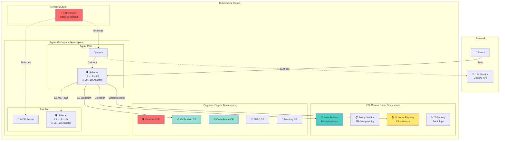
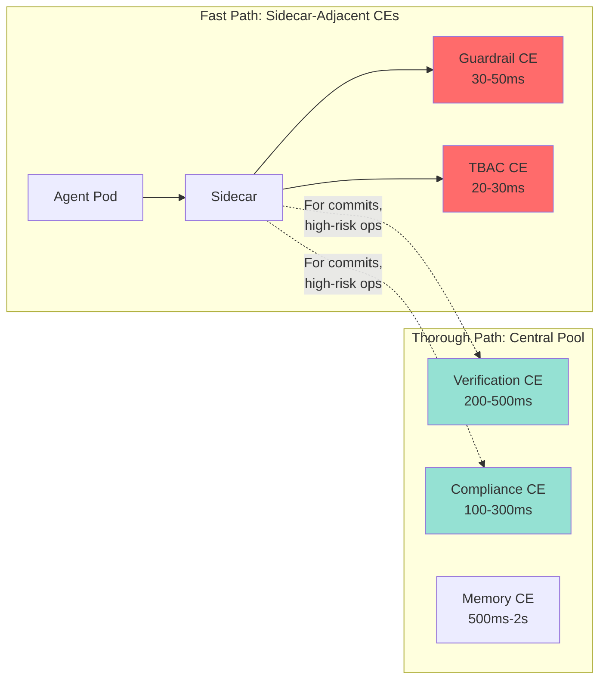
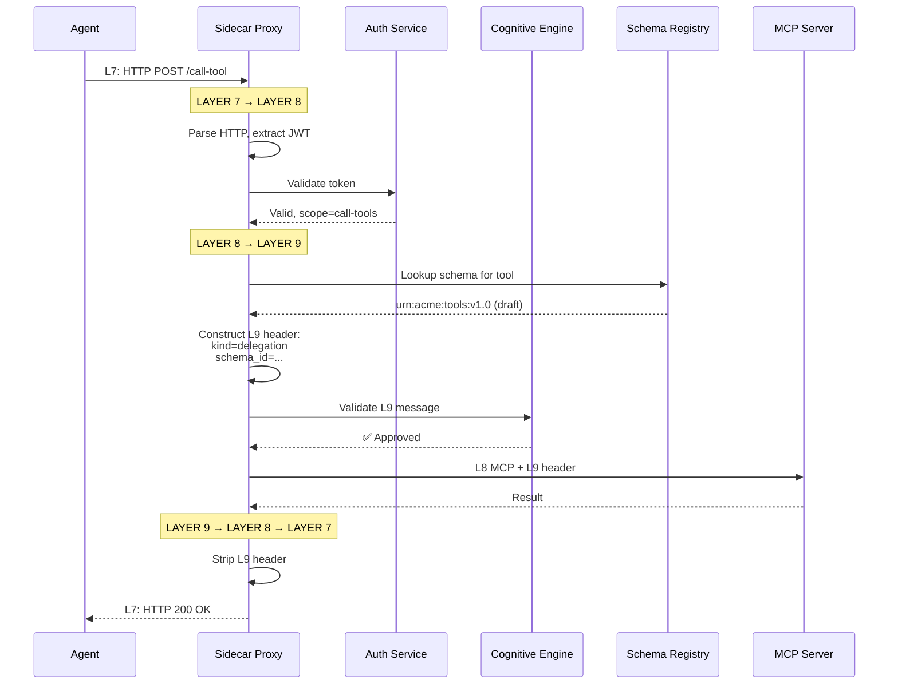
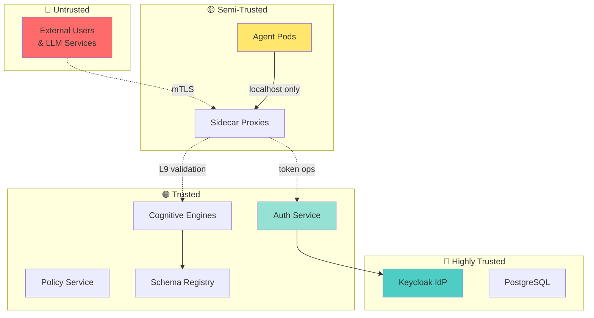
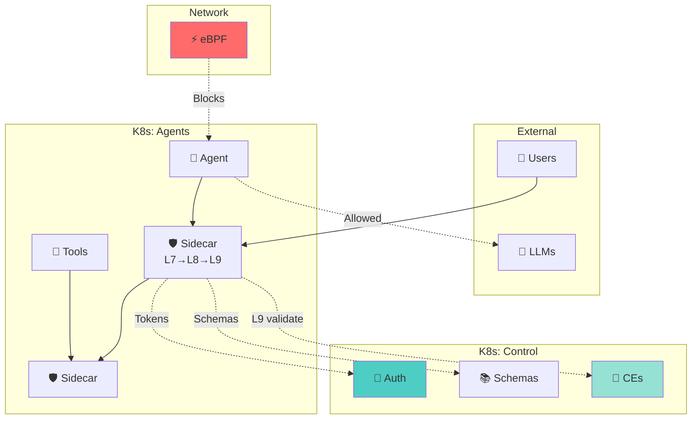

# Zero Trust Multi-Agent System with Internet of Cognition (IoC)

## Executive Summary

This architecture enables **secure, governed AI agent deployments** in Kubernetes by combining Zero Trust Authorization (ZTA) with the Internet of Cognition (IoC) Layer 9 semantic layer.

**The Challenge:**
AI agents make autonomous decisions, call external APIs, and execute tools—creating significant security and governance risks:
- Agents can access unauthorized data or services
- Critical decisions lack verification or accountability
- Cross-organizational collaboration has no trust framework
- No semantic understanding of what agents are doing

**Our Solution: Three-Layer Security + AI Oversight**

We extend traditional network security with two new layers:
- **Layer 7**: Standard HTTP/REST (what applications use)
- **Layer 8**: Agent protocols—A2A (agent-to-agent) and MCP (tool invocation)
- **Layer 9**: Semantic governance—validates *what messages mean* and enforces policies

**Sidecar proxies** translate between all three layers, while **Cognitive Engines** provide AI-powered oversight (guardrails, verification, compliance).

**Key Benefits:**
- ✅ **Zero Trust**: Deny-by-default networking with token-based authorization
- ✅ **Semantic Governance**: Policies based on meaning, not just network rules
- ✅ **Multi-Engine Oversight**: Pluggable Cognitive Engines for safety, compliance, and verification
- ✅ **Cross-Org Trust**: Standardized protocols enable secure federation
- ✅ **Cloud-Native**: Deploys via Helm charts, CRDs, and Cilium eBPF

---

## 1. The Three-Layer Architecture

### Layer Stack

```
┌─────────────────────────────────────┐
│  AI Agent Applications              │  ← Your intelligent systems
├─────────────────────────────────────┤
│  Layer 9: Semantic Governance       │  ← WHAT DOES IT MEAN?
│  • 7 cognitive primitives           │  • Schema validation
│  • Intent, delegation, commit       │  • Evidence requirements
│  • SSTP/CSTP/LSTP protocols         │  • Cross-org policies
├─────────────────────────────────────┤
│  Layer 8: Agent Protocols           │  ← HOW DO AGENTS TALK?
│  • A2A: Agent-to-agent messaging    │  • CRD-based policies
│  • MCP: Tool invocation             │  • Protocol enforcement
├─────────────────────────────────────┤
│  Layer 7: Application APIs          │  ← TRADITIONAL WEB
│  • HTTP/REST/gRPC                   │  • JWT tokens
│  • Service-to-service calls         │  • TLS encryption
├─────────────────────────────────────┤
│  Layers 3-6: Network                │  ← ZERO TRUST NETWORK
│  • eBPF/Cilium enforcement          │  • Deny-by-default
│  • Identity-aware policies          │  • Kernel-level filtering
└─────────────────────────────────────┘

Supporting Infrastructure:
┌─────────────────────────────────────┐
│  Cognitive Engines (Multiple)       │  ← AI OVERSIGHT
│  • Guardrails    • Verification     │
│  • Compliance    • Memory curation  │
│  • TBAC          • L8↔L9 adaptation │
└─────────────────────────────────────┘

┌─────────────────────────────────────┐
│  ZTA Control Plane                  │  ← AUTHORIZATION
│  • Auth Service  • Policy Service   │
│  • Schema Registry                  │
└─────────────────────────────────────┘
```

### Why Three Layers?

**Layer 7** handles basic HTTP communication but doesn't understand agents or their intent.

**Layer 8** adds agent capabilities:
- **A2A Protocol**: Agents negotiate, delegate tasks, and coordinate
- **MCP Protocol**: Agents discover and invoke tools
- **Limitation**: No semantic standardization or governance

**Layer 9** adds semantic meaning:
- **What is the cognitive purpose?** (intent, delegation, commit, query)
- **What semantic contract applies?** (schema validation)
- **Can this cross trust boundaries?** (policy enforcement)
- **Is evidence required?** (commit gating)

**Example: Agent Accessing Patient Data**

| Layer | What Happens | Enforcement |
|-------|--------------|-------------|
| **L7** | `HTTP POST /api/patient/12345` | JWT token valid? |
| **L8** | `MCP call: get_patient(id=12345)` | Tool authorized? A2A policy allows? |
| **L9** | `kind: delegation`<br/>`schema: urn:hospital:patient_access:v1.0`<br/>`sensitivity: confidential` | Schema certified?<br/>Evidence bundle attached?<br/>Compliance CE approves?<br/>Propagation policy allows? |

All three layers must approve before the request proceeds.

---

## 2. System Architecture

### Deployment Topology



### Core Components

| Component | Purpose | Why It Matters |
|-----------|---------|----------------|
| **Sidecar Proxy** | Translates L7→L8→L9, enforces policies | Transparent security—no agent code changes |
| **Auth Service** | Issues short-lived, scoped tokens | Zero Trust: every action requires fresh authorization |
| **Cognitive Engines** | AI-powered validation and oversight | Verifies intent, safety, compliance beyond static rules |
| **Schema Registry** | Stores L9 semantic contracts | Enables cross-org trust with schema certification |
| **Policy Service** | Manages MAS, apps, A2A/MCP policies | Central governance for multi-agent systems |
| **eBPF/Cilium** | Kernel-level network enforcement | Blocks attacks before they reach applications |

---

## 3. Layer 9: Semantic Governance

### The Seven Cognitive Primitives

Every L9 message has a `kind` that defines its cognitive purpose:

| Kind | Meaning | When Used | Governance |
|------|---------|-----------|------------|
| **intent** | Goal or objective | "Route patient to specialist" | Triggers context-building CEs |
| **delegation** | Task assignment | "Check drug interactions for Rx" | Requires schema validation |
| **knowledge** | Claim or assertion | "Drug A + Drug B interact" | No state stabilization |
| **query** | Request for info | "Is provider in-network?" | Discovery operations |
| **evidence_bundle** | Proof supporting claim | Verification report with sources | Required for commits |
| **commit** | Final, binding decision | "Approve medication change" | **Must have certified schema + evidence** |
| **memory_delta** | Knowledge update | "Add interaction to guidelines" | Propagates institutional learning |

### Schema Lifecycle: Progressive Governance

Schemas evolve through three trust levels:

```
┌─────────────────────────────────────────────────────┐
│ 1. INLINE (Exploratory)                             │
│ • Schema embedded in message header                 │
│ • Rapid prototyping, self-describing contracts      │
│ • ❌ Cannot be used for commits or cross-org        │
├─────────────────────────────────────────────────────┤
│ 2. DRAFT (Team Collaboration)                       │
│ • Registered in Schema Registry                     │
│ • Versioned, discoverable, team-wide                │
│ • ❌ Cannot be used for commits or cross-org        │
├─────────────────────────────────────────────────────┤
│ 3. CERTIFIED (Production)                           │
│ • Reviewed, approved, signed in registry            │
│ • ✅ Required for commits, cross-org, memory writes │
│ • Immutable once published                          │
└─────────────────────────────────────────────────────┘
```

**Design Philosophy**: Schemas emerge organically from agent interactions and are progressively formalized as patterns stabilize.

### L9 Canonical Header

The header contains everything needed for governance **without inspecting payloads**:

```yaml
# Required fields
protocol: SSTP | CSTP | LSTP
kind: intent | delegation | knowledge | query | commit | memory_delta | evidence_bundle
message_id: <uuid>

# Semantic context
semantic_context:
  schema_id: urn:acme:domain:type:v1.0
  schema_trust_level: inline | draft | certified

# Policy enforcement
policy_labels:
  sensitivity: public | internal | confidential
  propagation: forward | restricted | no_forward

# Identity & provenance
origin:
  actor_id: agent-123
  tenant_id: org-a

# State coordination (optional)
state_object_id: <urn>
logical_clock: <lamport/vector>
```

**Why Header-Driven?**
- ✅ **Privacy-preserving**: No need to parse sensitive payloads
- ✅ **High performance**: Route/enforce without deep inspection
- ✅ **Multi-modal**: Works with JSON (SSTP), embeddings (CSTP), tensors (LSTP)

### The Three Exchange Protocols

| Protocol | Payload Type | Use Case |
|----------|--------------|----------|
| **SSTP** | Structured JSON | Most agent communications (intent, delegation, commit) |
| **CSTP** | Embeddings/vectors | Semantic similarity, clustering |
| **LSTP** | Tensors/model state | High-fidelity model coordination |

All three share the same canonical header—only the payload modality varies.

---

## 4. Cognitive Engines: Multiple AI Oversight

### What Are Cognitive Engines?

**Cognitive Engines (CEs)** are specialized AI modules that validate, verify, and guide agent behavior. They operate **on** the system, not **in** it—providing cross-cutting oversight.

Think of them as:
- 🛡️ **Safety officers**: Block unsafe content and actions
- 🔍 **Auditors**: Verify claims with evidence
- 🎯 **Intent validators**: Ensure tools match delegated tasks
- ⚖️ **Compliance officers**: Check regulatory requirements
- 🧠 **Knowledge curators**: Manage institutional memory

### Two Deployment Models



**Sidecar-Adjacent CEs** (deployed locally):
- Ultra-low latency (<100ms)
- Invoked on every message
- Examples: Content filtering, basic TBAC

**Central CE Pool** (shared control plane):
- Thorough analysis (100ms-2s)
- Invoked for high-value operations
- Examples: Evidence verification, compliance auditing, memory curation

### Representative CE Types

| CE Type | Function | Trigger | Impact |
|---------|----------|---------|--------|
| **L8↔L9 Adaptor** | Wraps legacy L8 messages in L9 headers | Every L8 message | Enables gradual migration |
| **Guardrail CE** | Content safety, PII redaction | High-risk schemas | Blocks unsafe content |
| **Semantic TBAC** | Validates tool calls match delegated intent | Tool invocations | Prevents scope creep |
| **Verification CE** | Runs tests, generates evidence bundles | Pre-commit | Ensures correctness |
| **Compliance CE** | Checks HIPAA, GDPR, SOC2 requirements | Commits, memory writes | Legal/regulatory compliance |
| **Memory Curation** | Deduplicates, validates knowledge updates | Memory deltas | Institutional learning |

**Example: Financial Wire Transfer**

```
Agent attempts: kind=commit, schema=urn:bank:wire_transfer:v1.0

Sidecar orchestrates:
  1. ✅ Token scope = financial-ops → Auth Service
  2. ✅ Schema trust level = certified → Schema Registry
  3. 🧠 Verification CE → runs fraud checks, generates evidence
  4. 🧠 Compliance CE → validates AML/KYC rules
  5. 🧠 Risk CE → scores transaction risk

All CEs approve → Commit proceeds → Memory delta propagates
Any CE rejects → Transaction blocked → Alert generated
```

---

## 5. The Sidecar: L7→L8→L9 Translation

### Protocol Gateway

The sidecar acts as a transparent protocol gateway that translates between layers:



### When Is L9 Enrichment Applied?

Not every message needs L9. The sidecar uses **configurable enrichment rules**:

| Trigger | L9 Applied? | Reason |
|---------|-------------|--------|
| **Commit operations** | ✅ Always | Requires schema validation + evidence |
| **Memory writes** | ✅ Always | Institutional knowledge must be verified |
| **Cross-organization** | ✅ Always | Trust boundaries require semantic validation |
| **High-risk schemas** | ✅ Always | Financial, healthcare, PII operations |
| **Explicit annotation** | ✅ If tagged | Developer opts in: `l9.enabled=true` |
| **Simple queries** | ❌ Skip | Performance optimization for low-risk ops |

This selective enrichment balances security with performance.

---

## 6. Layer 8 Policies: A2A and MCP

### A2A Policy (Agent-to-Agent Communication)

Defined as Kubernetes CRDs:

```yaml
apiVersion: zta.io/v1
kind: A2APolicy
metadata:
  name: orchestration-policy
  namespace: production-mas
spec:
  mas_id: production-mas
  rules:
    - name: "Orchestrator can delegate"
      from:
        agent_role: orchestrator
      to:
        agent_role: worker
      actions: [delegate, query]

    - name: "Workers can report back"
      from:
        agent_role: worker
      to:
        agent_role: orchestrator
      actions: [knowledge, evidence_bundle]
```

**Enforcement**: Sidecar checks A2A policy before forwarding messages between agents.

### MCP Policy (Tool Invocation)

```yaml
apiVersion: zta.io/v1
kind: MCPPolicy
metadata:
  name: tool-access-policy
  namespace: production-mas
spec:
  mas_id: production-mas
  tools:
    - name: filesystem_read
      allowed_agents: [orchestrator, worker]
      requires_evidence: false

    - name: database_write
      allowed_agents: [orchestrator]
      requires_evidence: true
      cognitive_engines: [verification-ce, compliance-ce]
```

**Enforcement**: Sidecar validates tool access + invokes required CEs.

---

## 7. Token Architecture

### Multi-Token Flow

Agents use different tokens for different operations:

| Token | Purpose | Lifetime | Scope | Issued By |
|-------|---------|----------|-------|-----------|
| **T1: User Token** | User authenticates task | 1 hour | `mas_id`, `user_input_id` | Auth Service |
| **T2: LLM Token** | Call external LLM | 15 min | `llm-access`, rate limits | Token exchange |
| **T3: Tool Token** | Invoke specific tools | 5 min | `call-tools`, `tools: [...]` | Token exchange |
| **T4: Commit Token** | Make final decisions | 2 min | `commit`, requires certified schema | Token exchange |

**Token Exchange Flow**:

```
User submits task → T1 (user token)
    ↓ exchange
Agent calls LLM → T2 (LLM token)
    ↓ exchange
Agent calls tool → T3 (tool token)
    ↓ exchange + L9 validation
Agent commits decision → T4 (commit token)
```

Each exchange:
1. Validates the previous token allows escalation
2. Runs **intent matching** (does tool align with user task?)
3. Issues a narrower-scoped token
4. Logs the operation for audit

---

## 8. Network Security: eBPF/Cilium

### Four-Layer Defense

Security is enforced independently at each layer:

```
┌──────────────────────────────────┐
│ L9: Semantic                    │ ← CEs validate meaning
│ • Schema compliance             │
│ • Evidence requirements         │
├──────────────────────────────────┤
│ L8: Protocol                    │ ← Sidecar enforces A2A/MCP
│ • A2A/MCP policies              │
│ • Tool authorization            │
├──────────────────────────────────┤
│ L7: Application                 │ ← Sidecar validates tokens
│ • JWT validation                │
│ • Scope checking                │
├──────────────────────────────────┤
│ L3/L4: Network                  │ ← eBPF blocks at kernel
│ • Deny-by-default               │
│ • Identity-aware filtering      │
└──────────────────────────────────┘
```

### eBPF: Kernel-Level Enforcement

**eBPF** (Extended Berkeley Packet Filter) intercepts network packets in the Linux kernel **before they reach applications**:

- ✅ **Deny-by-default**: Only explicitly allowed traffic passes
- ✅ **Identity-aware**: Policies based on workload identity (not IPs)
- ✅ **FQDN filtering**: Agents can only reach approved domains (`api.openai.com`)
- ✅ **Protocol enforcement**: Blocks non-A2A/MCP traffic between agents

**Example: Agent Network Policy**

```yaml
apiVersion: cilium.io/v2
kind: CiliumNetworkPolicy
metadata:
  name: agent-policy
spec:
  endpointSelector:
    matchLabels:
      app: agent
  egress:
    - toEndpoints:
      - matchLabels:
          app: mcp-server
      toPorts:
      - ports:
        - port: "8080"
          protocol: TCP
        rules:
          l7:
          - protocol: MCP

    - toFQDNs:
      - matchName: api.openai.com
      toPorts:
      - ports:
        - port: "443"
          protocol: TCP

    - toEndpoints:
      - matchLabels:
          app: auth-service
```

If a compromised agent tries to:
- ❌ Exfiltrate data to `attacker.com` → eBPF blocks (FQDN not allowed)
- ❌ Scan internal network → eBPF blocks (no wildcard egress)
- ❌ Call non-MCP service → eBPF blocks (L7 protocol mismatch)

---

## 9. Deployment & Packaging

### Helm Chart Structure

```
zta-ioc-system/
├── charts/
│   ├── control-plane/           # Auth, Policy, Telemetry
│   ├── cognitive-engines/       # CE pool + Schema Registry
│   └── sidecar/                 # Sidecar injector
├── crds/
│   ├── multiagentsystem.yaml   # MAS definition
│   ├── a2apolicy.yaml          # L8 A2A policies
│   ├── mcppolicy.yaml          # L8 MCP policies
│   ├── l9policy.yaml           # L9 semantic policies
│   ├── cognitiveengine.yaml    # CE configuration
│   └── schemacontract.yaml     # L9 schema definitions
└── values.yaml
```

### Custom Resource Definitions

**MultiAgentSystem CRD**:

```yaml
apiVersion: zta.io/v1
kind: MultiAgentSystem
metadata:
  name: production-mas
  namespace: production-mas
spec:
  authorizationServer: production-realm
  enabledToolChecks:
    - DETERMINISTIC_TOOL_SELECTED
    - AI_POWERED_TOOL_MATCH
  l9Enrichment:
    enabled: true
    rules:
      - trigger: commit
        required: true
      - trigger: memory_delta
        required: true
  apps:
    - name: orchestrator-agent
      type: agent
      cognitiveEngines:
        - guardrail-ce
        - tbac-ce
```

**L9Policy CRD**:

```yaml
apiVersion: ioc.io/v1
kind: L9Policy
metadata:
  name: financial-governance
  namespace: production-mas
spec:
  schemaPattern: "urn:acme:financial:*"
  rules:
    - kind: commit
      requires:
        schemaTrustLevel: certified
        evidence: true
        cognitiveEngines:
          - verification-ce
          - compliance-ce
```

**CognitiveEngine CRD**:

```yaml
apiVersion: ioc.io/v1
kind: CognitiveEngine
metadata:
  name: compliance-ce
  namespace: cognitive-engines
spec:
  type: compliance
  deployment: central-pool
  image: acme/compliance-ce:v1.0
  replicas: 3
  resources:
    cpu: "500m"
    memory: "1Gi"
  triggers:
    - kind: commit
      schemaPattern: "urn:acme:financial:*"
```

### Sidecar Injection

Automatic injection via pod annotation:

```yaml
apiVersion: v1
kind: Pod
metadata:
  annotations:
    zta.io/inject: "true"
    zta.io/l9-enrichment: "enabled"
    zta.io/local-ces: "guardrail-ce,tbac-ce"
spec:
  containers:
  - name: agent
    image: acme/agent:v1.0
```

The mutating webhook injects:
1. Sidecar container
2. Local CE containers
3. Shared volume for socket communication
4. Network policy labels

---

## 10. Observability

### Multi-Layer Tracing

Every request receives a trace ID that flows through all layers:

```
Trace: 7f8a9b2c-3d4e-5f6a-7b8c-9d0e1f2a3b4c

📊 L7: HTTP POST /invoke-tool (450ms total)
   ├─ Token: T1 (user-scoped)
   ├─ Status: 200 OK
   │
   ├─ 📊 L8: MCP tool call "database_write" (220ms)
   │  ├─ Protocol: MCP
   │  ├─ Policy: mcp-policy → ALLOWED
   │  ├─ Token: T3 (tool-scoped)
   │  │
   │  └─ 📊 L9: Semantic validation (100ms)
   │     ├─ Kind: delegation
   │     ├─ Schema: urn:acme:db:write:v2.0 (certified)
   │     ├─ Guardrail CE: 40ms ✅
   │     ├─ TBAC CE: 30ms ✅
   │     └─ Verification CE: 30ms ✅
   │
   └─ eBPF: Allowed (identity-based policy)
```

### Key Metrics

| Layer | Metrics Tracked | Purpose |
|-------|----------------|---------|
| **L7** | Request rate, latency, errors | Standard API monitoring |
| **L8** | A2A vs MCP traffic, policy denials | Agent behavior patterns |
| **L9** | Messages by `kind`, schema validation failures | Semantic governance health |
| **CEs** | Invocations, latency, approval rate | Oversight effectiveness |
| **eBPF** | Blocked connections, policy violations | Network threat detection |

### Scaling Strategy

| Component | Scaling Approach | Trigger Metric |
|-----------|------------------|----------------|
| Auth Service | Horizontal (stateless) | Token issuance rate |
| Cognitive Engines | Horizontal per CE type | CE-specific invocation rate |
| Sidecar Proxies | 1:1 with workloads | Automatic (admission controller) |
| Schema Registry | Read replicas | Schema lookup rate |

---

## 11. Security & Threat Model

### Key Threats & Mitigations

| Threat | Impact | Mitigation | Layers |
|--------|--------|------------|--------|
| **Token theft** | Attacker impersonates agent | Short-lived tokens (2-60min), rotation, eBPF blocks exfiltration | L7, L3/L4 |
| **Unauthorized tool use** | Agent accesses forbidden tools | Scope-based tokens + TBAC CE validates intent | L8, L9 |
| **Malicious commit** | Agent makes harmful decisions | Commit requires certified schema + evidence + CE approval | L9 |
| **Cross-org data leak** | Sensitive data leaves organization | `propagation: no_forward` label enforced at L9 | L9 |
| **Compromised agent** | Agent scans network or exfiltrates | Deny-by-default eBPF, FQDN filtering | L3/L4 |
| **Schema injection** | Attacker creates malicious schema | Only certified schemas allowed for commits | L9 |
| **Memory poisoning** | False knowledge injected | Memory CE validates all `memory_delta` messages | L9 |

### Trust Boundaries



---

## 12. Design Decisions

### Why Layer 9?

**Problem**: L8 protocols (A2A, MCP) handle agent communication but lack semantic governance:
- ❌ No validation that tools align with user intent
- ❌ No cross-organizational trust model
- ❌ No evidence requirements for decisions
- ❌ No institutional memory propagation

**Solution**: L9 adds semantic meaning:
- ✅ Seven cognitive primitives define message purpose
- ✅ Schema contracts enable cross-org trust
- ✅ Commit gating requires evidence
- ✅ Memory deltas propagate knowledge

**Tradeoff**: Adds 50-100ms latency, but only for high-value operations.

### Why Multiple Cognitive Engines?

**Problem**: Monolithic "AI safety" module cannot:
- Handle diverse domains (finance, healthcare, general)
- Scale independently per concern
- Be customized per organization

**Solution**: Pluggable CEs with two deployment models:
- Sidecar-adjacent for low-latency checks
- Central pool for thorough analysis

**Benefit**: Specialized oversight scales independently.

### Why Progressive Schema Governance?

**Problem**: Requiring certified schemas for all messages stifles innovation. But unvalidated schemas create risk.

**Solution**: Three-stage lifecycle (inline → draft → certified) allows:
- Rapid prototyping (inline)
- Team collaboration (draft)
- Production safety (certified)

**Benefit**: Schemas emerge organically and are formalized as needed.

---

## 13. Implementation Roadmap

### Phase 1: Foundation (4 weeks)
- ✅ Deploy ZTA control plane (Auth, Policy, Telemetry)
- ✅ Configure Cilium eBPF (deny-by-default policies)
- ✅ Inject sidecars (L7 validation only)
- ✅ Validate token flow (issuance, exchange, introspection)

**Milestone**: Zero Trust networking operational

### Phase 2: Layer 8 (4 weeks)
- ✅ Enable L8 protocol translation (A2A/MCP)
- ✅ Deploy A2A and MCP policy CRDs
- ✅ Test agent-to-agent and agent-to-tool flows

**Milestone**: Protocol-aware enforcement operational

### Phase 3: Layer 9 Basics (4 weeks)
- ✅ Deploy Schema Registry
- ✅ Enable L9 enrichment for commits only
- ✅ Deploy L8↔L9 Adaptor CE
- ✅ Test schema validation and commit gating

**Milestone**: Semantic governance for critical operations

### Phase 4: Cognitive Engines (6 weeks)
- ✅ Deploy CE pool (Guardrail, TBAC, Verification, Compliance)
- ✅ Configure sidecar-adjacent CEs
- ✅ Enable evidence bundling
- ✅ Test CE orchestration

**Milestone**: Full AI oversight operational

### Phase 5: Production (6 weeks)
- ✅ Enable L9 for all high-value operations
- ✅ Deploy Memory Curation CE
- ✅ Enable cross-org federation (if needed)
- ✅ Production monitoring and optimization

**Milestone**: Full IoC-integrated Zero Trust system

**Total**: 24 weeks (6 months)

---

## 14. Conclusion

This architecture combines **Zero Trust security** with **semantic governance** to enable safe, accountable AI agent deployments in Kubernetes.

**Key Capabilities:**
- ✅ **Multi-layer security**: L7/L8/L9 + eBPF enforcement
- ✅ **Multiple Cognitive Engines**: Specialized AI oversight for safety, compliance, verification
- ✅ **Semantic governance**: Policies enforce meaning, not just network rules
- ✅ **Progressive schemas**: Innovation-friendly governance model
- ✅ **Cloud-native**: Helm, CRDs, admission controllers, eBPF

**The system is production-ready** and designed to evolve as agent capabilities mature.

---

## Appendix: Quick Reference

### Glossary

| Term | Definition |
|------|------------|
| **A2A** | Agent-to-Agent protocol (L8) for agent communication |
| **CE** | Cognitive Engine—AI oversight module |
| **L7/L8/L9** | Layer 7 (HTTP), Layer 8 (A2A/MCP), Layer 9 (Semantic) |
| **MCP** | Model Context Protocol (L8) for tool invocation |
| **SSTP/CSTP/LSTP** | L9 protocols: Structured/Compressed/Latent State Transfer |
| **TBAC** | Task-Based Access Control—validates tools match intent |
| **eBPF** | Extended Berkeley Packet Filter—kernel-level network filtering |

### Architecture Summary



---

**Document Version**: 3.0  
**Status**: Final Architecture Specification  
**Target**: Kubernetes 1.28+, Cilium 1.14+
