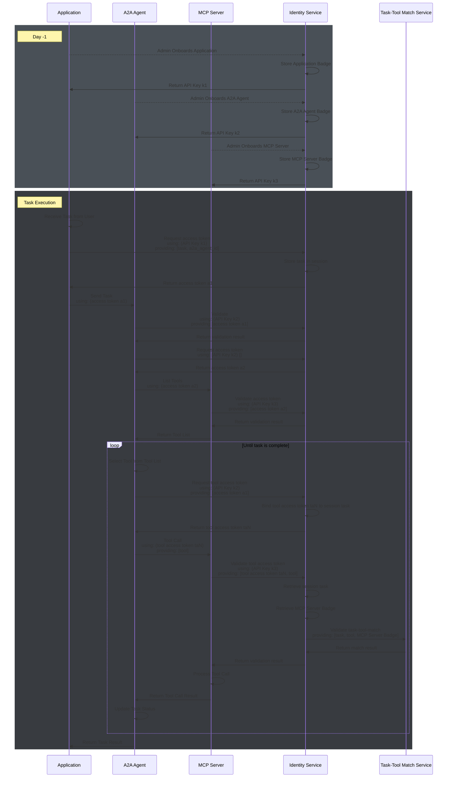

# Authentication Flow

```mermaid
sequenceDiagram
    participant Application
    participant A2A Agent
    participant MCP Server
    participant Identity Service
    participant Task-Tool Match Service
    rect rgb(73, 80, 87)
    note left of Application: Day -1
    Application-->>Identity Service: Admin Onboards Application
    Identity Service->>Identity Service: Store Application Badge
    Identity Service->>Application: Return API Key k1
    A2A Agent-->>Identity Service: Admin Onboards A2A Agent
    Identity Service->>Identity Service: Store A2A Agent Badge
    Identity Service->>A2A Agent: Return API Key k2
    MCP Server-->>Identity Service: Admin Onboards MCP Server
    Identity Service->>Identity Service: Store MCP Server Badge
    Identity Service->>MCP Server: Return API Key k3
    end
    rect rgb(56, 59, 64)
    note left of Application: Task Execution
    Application->>Application: Receive Task from User
    Application->>Identity Service: Request access token<br/>using: (API Key k1)<br/>providing: [task, a2a_agent_id]
    Identity Service->>Identity Service: Store task in session
    Identity Service->>Application: Return access token a1
    Application->>A2A Agent: Send Task<br/>using: (access token a1)
    A2A Agent->>Identity Service: Validate<br/>using: (API Key k2)<br/>providing [access token a1]
    Identity Service->>A2A Agent: Return validation result
    A2A Agent->>Identity Service: Request access token<br/>using: (API Key k2) []
    Identity Service->>A2A Agent: Return access token a2
    A2A Agent->>MCP Server: List Tools<br/>using: (access token a2)
    MCP Server->>Identity Service: Validate access token<br/>using: (API Key k3)<br/>providing: [access token a2]
    Identity Service->>MCP Server: Return validation result
    MCP Server->>A2A Agent: Return Tool List
    loop Until task is complete
    A2A Agent->>A2A Agent: Select Tool from Tool List
    A2A Agent->>Identity Service: Request tool access token<br/>using: (API Key k2)<br/>providing: [access token a1]
    Identity Service->>Identity Service: Bind tool access token taN to session task
    Identity Service->>A2A Agent: Return tool access token taN
    A2A Agent->>MCP Server: Tool Call<br/>using: (tool access token taN)<br/>providing: [tool]
    MCP Server->>Identity Service: Validate tool access token<br/>using: (API Key k3)<br/>providing: [tool access token taN, tool]
    Identity Service->>Identity Service: Retrieve session task
    Identity Service->>Identity Service: Retrieve MCP Server Badge
    Identity Service->>Task-Tool Match Service: Validate task-tool-match<br/>providing: [task, tool, MCP Server Badge]
    Task-Tool Match Service->>Identity Service: Return match result
    Identity Service->>MCP Server: Return validation result
    MCP Server->>MCP Server: Process Tool Call
    MCP Server->>A2A Agent: Return Tool Call Result
    A2A Agent->>A2A Agent: Update Task Status
    end
    A2A Agent->>Application: Return Task Result
    end

```
