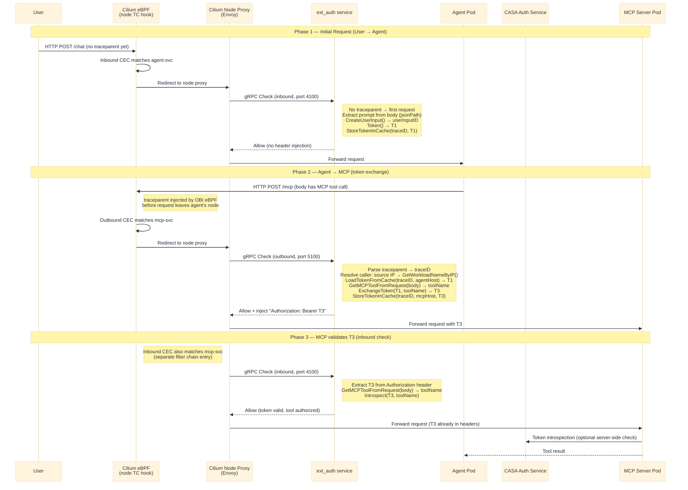
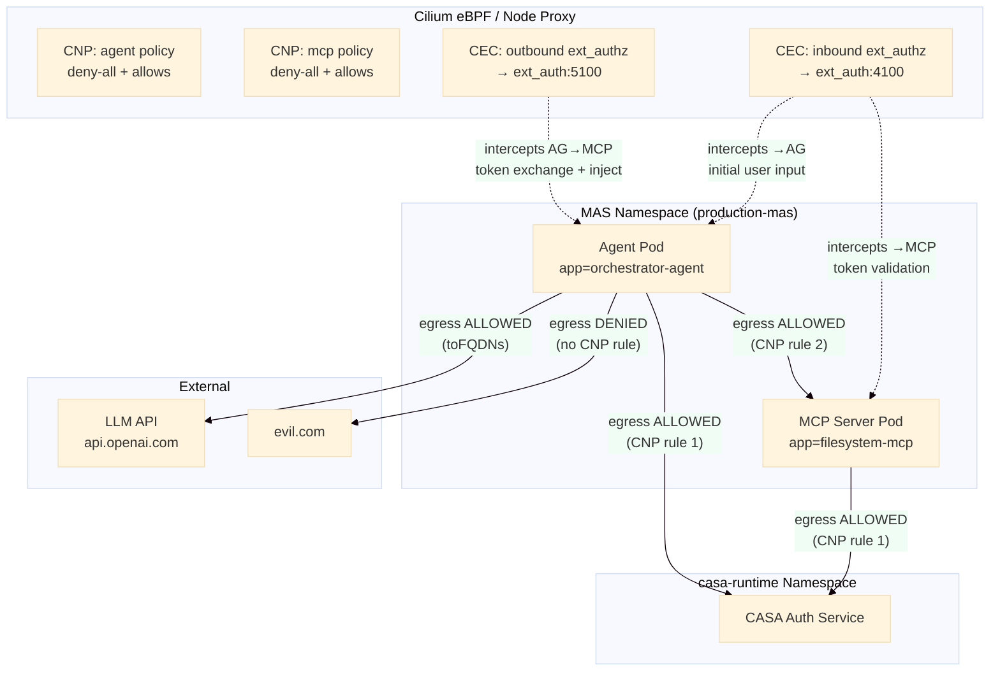

# CASA Cilium Support — v1 Architecture Spec

**Status:** Draft  
**Date:** 2026-05-05  
**Audience:** Platform engineers, backend engineers implementing Cilium mode

---

## 1. Overview

### 1.1 Why Cilium Mode

The current CASA deployment requires Istio as a service mesh. Istio injects a per-pod Envoy sidecar and uses Istio-specific CRDs (`EnvoyFilter`, `WasmPlugin`, `ServiceEntry`, `DestinationRule`) to wire the ext_authz filter chain. This creates a hard dependency on Istio and its CRD APIs.

Cilium mode removes the Istio dependency entirely and provides:

- **Kernel-level eBPF enforcement** via Cilium's native CNI, without a separate service mesh layer
- **Node-level Envoy proxy** (Cilium's built-in proxy, part of the DaemonSet) instead of per-pod sidecars — no mutating webhook, no per-pod resource overhead
- **`CiliumNetworkPolicy`** (CNP) for deny-by-default L3/L4/L7 enforcement using pod label identity instead of IP addresses
- **`CiliumEnvoyConfig`** (CEC) as the Kubernetes-native way to configure the Cilium node proxy's Envoy filter chains — a direct functional replacement for Istio's `EnvoyFilter`
- **Hubble** for eBPF flow observability with zero additional instrumentation

### 1.2 What Changes

| Concern                   | Istio Mode                              | Cilium Mode                               |
| ------------------------- | --------------------------------------- | ----------------------------------------- |
| Traffic interception      | Per-pod Envoy sidecar (Istio injection) | Node-level Envoy proxy (Cilium DaemonSet) |
| ext_authz wiring          | `EnvoyFilter` (Istio CRD)               | `CiliumEnvoyConfig` (Cilium CRD)          |
| LLM proxy Wasm            | `WasmPlugin` (Istio CRD)                | Wasm HTTP filter inside CEC               |
| Traceparent injection     | `WasmPlugin` (Istio CRD)                | OBI (eBPF-based, already in stack)        |
| LLM egress FQDN           | `ServiceEntry` + `DestinationRule`      | `CiliumNetworkPolicy` with `toFQDNs`      |
| Caller workload identity  | `x-envoy-peer-metadata` header          | Source IP → Kubernetes Pod lookup         |
| Namespace injection label | `istio-injection=enabled`               | `casa.io/injection=enabled`               |
| Cluster prerequisites     | Istio 1.17+                             | Cilium 1.14+                              |

### 1.3 What Does Not Change

- The **ext_auth gRPC service** (`sidecar/ext_auth/`) logic — inbound and outbound `Check()` handlers remain structurally the same; only caller identity resolution changes
- The **CASA auth server** (`src/casa_auth_server/`) — no changes required
- The **operator's auth-service sync** (`syncToAuthService`, `createSecrets`) — MAS registration and secret management are unchanged
- The **token flow** — T1 → T2 → T3 token exchange semantics are identical
- The **sidecar Helm chart's ext_auth Deployment** — the same Go binary runs in both modes

---

## 2. Architecture Comparison

### 2.1 Istio Mode (Current)

```
Pod (Agent)
  ├── init container (iptables redirect → port 15001/15002)
  ├── app container (port 8080)
  └── Envoy sidecar (Istio-injected)
       ├── SIDECAR_INBOUND listener (port 15001)
       │    └── EnvoyFilter ext_authz → ext_auth:4100
       └── SIDECAR_OUTBOUND listener (port 15002)
            └── EnvoyFilter ext_authz → ext_auth:5100

Operator creates per-MAS:
  └── ServiceEntry + DestinationRule (for LLM FQDN)

Sidecar Helm chart creates (static, per-namespace):
  ├── EnvoyFilter (ext_authz inbound + outbound)
  ├── WasmPlugin (llm_proxy, SIDECAR_OUTBOUND)
  └── WasmPlugin (traceparent_injector, SIDECAR_INBOUND)
```

### 2.2 Cilium Mode (Target)

```
Pod (Agent)
  └── app container (port 8080)  ← no sidecar, no init container

Node (Cilium DaemonSet)
  └── Cilium node proxy (embedded Envoy)
       ├── Inbound listener for MAS services
       │    └── CEC ext_authz filter → ext_auth:4100
       └── Outbound listener for agent-originated flows
            └── CEC ext_authz filter → ext_auth:5100

Operator creates per-MAS:
  ├── CiliumNetworkPolicy (per app: deny-all + explicit allows)
  └── CiliumEnvoyConfig (inbound + outbound ext_authz)
```

### 2.3 Traffic Interception Model

In Istio mode, traffic is redirected by `iptables` rules inside each pod to the per-pod Envoy sidecar. The sidecar sees all inbound and outbound traffic and calls ext_authz before forwarding.

In Cilium mode, traffic is redirected by **eBPF TC (traffic control) hooks** at the node kernel level. When a `CiliumEnvoyConfig` binds a service, Cilium's eBPF program redirects traffic destined to that service's endpoints to the node's Envoy proxy. The proxy applies the CEC-configured filter chain and calls ext_authz. This happens transparently — pods have no awareness of the interception.

Key implication: there is no per-pod `WORKLOAD_NAME` metadata injected (no `x-envoy-peer-metadata`). Caller identity must be resolved from the source IP in the ext_authz `CheckRequest`.

---

## 3. Prerequisites & Cluster Setup

### 3.1 Cilium Installation

Cilium 1.14+ with the following feature flags enabled:

```bash
helm upgrade --install cilium cilium/cilium \
  --namespace kube-system \
  --set kubeProxyReplacement=true \
  --set l7Proxy=true \
  --set envoyConfigEnabled=true \
  --set hubble.enabled=true \
  --set hubble.relay.enabled=true \
  --set hubble.ui.enabled=true
```

Feature flags:

- `l7Proxy=true` — enables Cilium's embedded Envoy node proxy, required for CEC
- `envoyConfigEnabled=true` — enables processing of `CiliumEnvoyConfig` resources
- `hubble.enabled=true` — enables eBPF flow logging (observability)

Minimum kernel version: **5.8** (required for eBPF socket ops and TC hooks used by Cilium L7 proxy).

### 3.2 No Istio

Istio must **not** be installed. The two data planes conflict at the traffic interception level (both use port 15001/15002 and iptables redirect). Do not label namespaces with `istio-injection=enabled`.

### 3.3 Namespace Labeling

Label MAS namespaces for CASA injection tracking (no Istio webhook, just a convention used by the operator):

```bash
kubectl label namespace <mas-namespace> casa.io/injection=enabled
```

---

## 4. Data Plane: CiliumNetworkPolicy

### 4.1 Purpose

`CiliumNetworkPolicy` (CNP) replaces the function of Istio `ServiceEntry` + `DestinationRule` for LLM egress, and adds deny-by-default enforcement. In the current Istio mode, Cilium CNP was described in the high-level specs as the intended enforcement mechanism — this section makes it concrete.

The operator creates CNP resources per-MAS when it detects `DATAPLANE_MODE=cilium`.

### 4.2 Agent App Policy

For each app of type `agent` in a `MultiAgentSystem`, the operator creates:

```yaml
apiVersion: cilium.io/v2
kind: CiliumNetworkPolicy
metadata:
    name: casa-mas-<mas-name>-<app-kubernetesWorkloadName>
    namespace: <mas-namespace>
    labels:
        app.kubernetes.io/managed-by: casa-operator
        casa.io/mas-name: <mas-name>
spec:
    # Selects agent pods by their kubernetesWorkloadName label
    endpointSelector:
        matchLabels:
            app: <app.kubernetesWorkloadName>

    ingress:
        # Allow inbound from any pod within the same MAS namespace
        # (entry point for user traffic, and for A2A agent-to-agent calls)
        - fromEndpoints:
              - matchLabels:
                    io.kubernetes.pod.namespace: <mas-namespace>

    egress:
        # Allow agent → CASA auth service (token exchange, introspection)
        - toEndpoints:
              - matchLabels:
                    io.kubernetes.pod.namespace: casa-runtime
                    app: casa-auth-service
          toPorts:
              - ports:
                    - port: "8000"
                      protocol: TCP

        # Allow agent → each MCP server in this MAS
        # (one rule per mcp_server app in the MAS spec)
        - toEndpoints:
              - matchLabels:
                    io.kubernetes.pod.namespace: <mas-namespace>
                    app: <mcp-app.kubernetesWorkloadName>
          toPorts:
              - ports:
                    - port: "<mcp-app.baseUrl.port>"
                      protocol: TCP

        # Allow agent → external LLM (single FQDN, port 443)
        # Replaces Istio ServiceEntry + DestinationRule
        - toFQDNs:
              - matchName: "<mas.spec.llm_host>"
          toPorts:
              - ports:
                    - port: "443"
                      protocol: TCP

        # Allow agent → ext_auth sidecar (for CEC L7 policy processing)
        - toEndpoints:
              - matchLabels:
                    io.kubernetes.pod.namespace: <sidecar-namespace>
                    app: ext-auth-service
          toPorts:
              - ports:
                    - port: "4100"
                      protocol: TCP
                    - port: "5100"
                      protocol: TCP
```

> **Note on `io.kubernetes.pod.namespace`**: Cilium uses this well-known label for cross-namespace endpoint selection. The namespace label is automatically added by Cilium to all pods.

### 4.3 MCP Server App Policy

For each app of type `mcp_server`:

```yaml
apiVersion: cilium.io/v2
kind: CiliumNetworkPolicy
metadata:
    name: casa-mas-<mas-name>-<app-kubernetesWorkloadName>
    namespace: <mas-namespace>
    labels:
        app.kubernetes.io/managed-by: casa-operator
        casa.io/mas-name: <mas-name>
spec:
    endpointSelector:
        matchLabels:
            app: <app.kubernetesWorkloadName>

    ingress:
        # Allow inbound from agent pods within the MAS namespace only
        - fromEndpoints:
              - matchLabels:
                    io.kubernetes.pod.namespace: <mas-namespace>
                    app: <agent-app.kubernetesWorkloadName>
          toPorts:
              - ports:
                    - port: "<mcp-app.baseUrl.port>"
                      protocol: TCP

    egress:
        # Allow MCP server → CASA auth service (token introspection)
        - toEndpoints:
              - matchLabels:
                    io.kubernetes.pod.namespace: casa-runtime
                    app: casa-auth-service
          toPorts:
              - ports:
                    - port: "8000"
                      protocol: TCP
```

### 4.4 LLM FQDN Enforcement

The `toFQDNs` rule in the agent's CNP is the functional replacement for the Istio `ServiceEntry` + `DestinationRule` pair the operator currently creates (`<mas-name>-llm-srv-entry` and `<mas-name>-llm-dr`). It restricts the agent to exactly one external LLM host and is enforced at kernel level via eBPF.

For Cilium's FQDN enforcement to work, the Cilium `toFQDNs` policy controller must be enabled (it is on by default when `l7Proxy=true`). Cilium intercepts DNS responses and programs eBPF maps with the resolved IPs.

---

## 5. Data Plane: CiliumEnvoyConfig

### 5.1 Purpose

`CiliumEnvoyConfig` (CEC) configures the Cilium node-level Envoy proxy's filter chain for specific Kubernetes services. It is the direct functional replacement for Istio's `EnvoyFilter` and `WasmPlugin` resources.

The operator creates CEC resources per-MAS in Cilium mode. There are two distinct CECs:

1. **Inbound CEC** — applied to traffic arriving at MAS service endpoints; calls ext_authz inbound (port 4100) for token validation / initial user input creation
2. **Outbound CEC** — applied to traffic originating from agent pods going to other MAS services or the external LLM; calls ext_authz outbound (port 5100) for token exchange and `Authorization` header injection

### 5.2 How CEC Works with Cilium

When a `CiliumEnvoyConfig` lists a Kubernetes service in `spec.services`, Cilium's eBPF hooks redirect traffic to that service's endpoints through the node Envoy proxy. The proxy processes the CEC-defined filter chain (including ext_authz) and then forwards to the original destination. This is transparent to both the caller and the receiver pods.

For the **outbound** direction (agent pod originating the request), the CEC uses Cilium's L7 proxy interception on egress flows. When an agent pod's traffic matches a `CiliumNetworkPolicy` rule that enables L7 processing (HTTP-aware rules), Cilium redirects that traffic through the node proxy before it leaves the node.

### 5.3 Inbound CEC

One inbound CEC per MAS, listing all service names from the MAS apps:

```yaml
apiVersion: cilium.io/v2
kind: CiliumEnvoyConfig
metadata:
    name: casa-inbound-<mas-name>
    namespace: <mas-namespace>
    labels:
        app.kubernetes.io/managed-by: casa-operator
        casa.io/mas-name: <mas-name>
spec:
    # Services whose inbound traffic is processed by this CEC.
    # One entry per app in the MAS spec.
    services:
        - name: <agent-svc-name>
          namespace: <mas-namespace>
        - name: <mcp-svc-name>
          namespace: <mas-namespace>

    resources:
        # Cluster pointing to the ext_auth service's INBOUND gRPC endpoint (port 4100)
        - "@type": type.googleapis.com/envoy.config.cluster.v3.Cluster
          name: ext-authz-inbound
          connect_timeout: "10s"
          type: STRICT_DNS
          lb_policy: ROUND_ROBIN
          typed_extension_protocol_options:
              envoy.extensions.upstreams.http.v3.HttpProtocolOptions:
                  "@type": type.googleapis.com/envoy.extensions.upstreams.http.v3.HttpProtocolOptions
                  explicit_http_config:
                      http2_protocol_options: {}
          load_assignment:
              cluster_name: ext-authz-inbound
              endpoints:
                  - lb_endpoints:
                        - endpoint:
                              address:
                                  socket_address:
                                      # ext_auth service deployed by the sidecar Helm chart
                                      address: "<ext-auth-svc>.<sidecar-namespace>.svc.cluster.local"
                                      port_value: 4100

        # HTTP connection manager listener with ext_authz filter
        - "@type": type.googleapis.com/envoy.config.listener.v3.Listener
          name: casa-inbound-listener
          filter_chains:
              - filters:
                    - name: envoy.filters.network.http_connection_manager
                      typed_config:
                          "@type": type.googleapis.com/envoy.extensions.filters.network.http_connection_manager.v3.HttpConnectionManager
                          stat_prefix: casa-inbound
                          http_filters:
                              - name: envoy.filters.http.ext_authz
                                typed_config:
                                    "@type": type.googleapis.com/envoy.extensions.filters.http.ext_authz.v3.ExtAuthz
                                    grpc_service:
                                        envoy_grpc:
                                            cluster_name: ext-authz-inbound
                                        timeout: "30s"
                                    transport_api_version: V3
                                    # Fail closed: deny if ext_auth is unreachable
                                    failure_mode_allow: false
                                    include_peer_certificate: true
                                    with_request_body:
                                        max_request_bytes: 60000
                                        allow_partial_message: true
                              - name: envoy.filters.http.router
                                typed_config:
                                    "@type": type.googleapis.com/envoy.extensions.filters.http.router.v3.Router
```

### 5.4 Outbound CEC

One outbound CEC per MAS. The `spec.services` lists the same services (traffic FROM agent pods going TO those services is intercepted), but the filter calls ext_authz **outbound** (port 5100) instead of 4100. The outbound ext_authz service exchanges tokens and injects `Authorization: Bearer <token>` headers into the request before it reaches the destination.

```yaml
apiVersion: cilium.io/v2
kind: CiliumEnvoyConfig
metadata:
    name: casa-outbound-<mas-name>
    namespace: <mas-namespace>
    labels:
        app.kubernetes.io/managed-by: casa-operator
        casa.io/mas-name: <mas-name>
spec:
    # Same services as the inbound CEC; Cilium applies this on the
    # egress path from agent pods heading to these service endpoints.
    services:
        - name: <agent-svc-name>
          namespace: <mas-namespace>
        - name: <mcp-svc-name>
          namespace: <mas-namespace>

    resources:
        - "@type": type.googleapis.com/envoy.config.cluster.v3.Cluster
          name: ext-authz-outbound
          connect_timeout: "10s"
          type: STRICT_DNS
          lb_policy: ROUND_ROBIN
          typed_extension_protocol_options:
              envoy.extensions.upstreams.http.v3.HttpProtocolOptions:
                  "@type": type.googleapis.com/envoy.extensions.upstreams.http.v3.HttpProtocolOptions
                  explicit_http_config:
                      http2_protocol_options: {}
          load_assignment:
              cluster_name: ext-authz-outbound
              endpoints:
                  - lb_endpoints:
                        - endpoint:
                              address:
                                  socket_address:
                                      address: "<ext-auth-svc>.<sidecar-namespace>.svc.cluster.local"
                                      port_value: 5100

        - "@type": type.googleapis.com/envoy.config.listener.v3.Listener
          name: casa-outbound-listener
          filter_chains:
              - filters:
                    - name: envoy.filters.network.http_connection_manager
                      typed_config:
                          "@type": type.googleapis.com/envoy.extensions.filters.network.http_connection_manager.v3.HttpConnectionManager
                          stat_prefix: casa-outbound
                          http_filters:
                              - name: envoy.filters.http.ext_authz
                                typed_config:
                                    "@type": type.googleapis.com/envoy.extensions.filters.http.ext_authz.v3.ExtAuthz
                                    grpc_service:
                                        envoy_grpc:
                                            cluster_name: ext-authz-outbound
                                        timeout: "30s"
                                    transport_api_version: V3
                                    failure_mode_allow: false
                                    include_peer_certificate: true
                                    with_request_body:
                                        max_request_bytes: 60000
                                        allow_partial_message: true
                              - name: envoy.filters.http.router
                                typed_config:
                                    "@type": type.googleapis.com/envoy.extensions.filters.http.router.v3.Router
```

### 5.5 LLM Proxy Wasm Filter (Cilium Mode)

In Istio mode, `sidecar/llm_proxy/` is deployed as a `WasmPlugin` resource. For Cilium mode, the same Wasm binary can be embedded as an HTTP Wasm filter inside the outbound CEC's `http_filters` chain, inserted **before** `ext_authz`:

```yaml
# Add before ext_authz in the outbound CEC's http_filters list
- name: envoy.filters.http.wasm
  typed_config:
      "@type": type.googleapis.com/envoy.extensions.filters.http.wasm.v3.Wasm
      config:
          name: casa-llm-proxy
          root_id: casa-llm-proxy
          configuration:
              "@type": type.googleapis.com/google.protobuf.StringValue
              value: |
                  {
                    "auth_server_host": "<auth-server-host>",
                    "auth_server_port": "8000"
                  }
          vm_config:
              vm_id: casa-llm-proxy
              runtime: envoy.wasm.runtime.v8
              code:
                  remote:
                      http_uri:
                          uri: "oci://<llm-proxy-image>:<tag>"
                          cluster: wasm-image-registry
                          timeout: "10s"
```

> **Alternative**: Distribute the Wasm binary as an HTTP URL or mount it via an init container / ConfigMap. OCI image pull within Envoy requires additional cluster configuration for the registry.

### 5.6 Traceparent Injection (Cilium Mode)

In Istio mode, `sidecar/traceparent_injector/` runs as a `WasmPlugin` to inject W3C `traceparent` headers. In Cilium mode, we could use an Envoy filter to do the same. (because of limited WASM support)

---

## 6. Operator Changes

### 6.1 Mode Detection

Add a `DATAPLANE_MODE` environment variable to the operator Deployment:

```yaml
env:
    - name: DATAPLANE_MODE
      value: "cilium" # or "istio" (default)
```

In `operator/main.go`, read this env var and pass it to the reconciler:

```go
dataPlaneMode := os.Getenv("DATAPLANE_MODE")
if dataPlaneMode == "" {
    dataPlaneMode = "istio"
}

NewMultiAgentSystemReconciler(mgr.GetClient(), clientset, authSrvClient, dataPlaneMode).SetupWithManager(mgr)
```

Add `dataPlaneMode string` field to `MultiAgentSystemReconciler`.

### 6.2 Reconcile Method

In `reconciler.go`, the reconcile loop currently calls:

```go
if err := r.createIstioResources(ctx, mas); err != nil { ... }
```

Replace with a mode switch:

```go
if r.dataPlaneMode == "cilium" {
    if err := r.createCiliumResources(ctx, mas); err != nil {
        log.Error(err, "failed to create Cilium resources")
        // Non-fatal: don't block reconcile, log and continue
    }
} else {
    if err := r.createIstioResources(ctx, mas); err != nil {
        log.Error(err, "failed to create Istio resources")
    }
}
```

Same pattern in the deletion path:

```go
if r.dataPlaneMode == "cilium" {
    if err := r.deleteCiliumResources(ctx, mas); err != nil { ... }
} else {
    if err := r.deleteIstioResources(ctx, mas); err != nil { ... }
}
```

### 6.3 `createCiliumResources(ctx, mas)`

New method in `operator/reconciler.go`. Creates CNPs and CECs for the MAS using `controllerutil.CreateOrUpdate` with `unstructured.Unstructured` objects (same pattern as the existing `createIstioResources`).

**Step 1**: Resolve the ext_auth service coordinates. Read from env vars `EXT_AUTH_SERVICE_NAME` and `EXT_AUTH_SERVICE_NAMESPACE` (set in the operator Deployment — defaults to `ext-auth-service` and `casa-sidecar`).

**Step 2**: For each app in `mas.Spec.Apps`, create a CNP:

- Populate `endpointSelector.matchLabels.app` with `app.KubernetesWorkloadName`
- Build egress rules based on `app.Type`:
  - `agent`: egress to auth service, all MCP server apps in this MAS, LLM FQDN
  - `mcp_server`: egress to auth service only
- Build ingress rules:
  - `agent`: ingress from any pod in the same namespace (MAS entry point)
  - `mcp_server`: ingress from agent pods only

**Step 3**: Create the inbound CEC with `spec.services` listing all apps' service names derived from `app.BaseURL.Host`.

**Step 4**: Create the outbound CEC with `spec.services` listing agent apps' service names (only agents originate outbound calls that need token exchange).

**Schema Group/Version for Cilium resources:**

```go
ciliumGVR := schema.GroupVersionResource{
    Group:    "cilium.io",
    Version:  "v2",
    Resource: "ciliumnetworkpolicies",
}
cecGVR := schema.GroupVersionResource{
    Group:    "cilium.io",
    Version:  "v2",
    Resource: "ciliumenvoyconfigs",
}
```

Use `r.Client` (controller-runtime client) with `unstructured.Unstructured` for create/update, same as `createIstioResources` uses for `ServiceEntry`/`DestinationRule`.

### 6.4 `deleteCiliumResources(ctx, mas)`

Delete all CNPs and CECs labeled `casa.io/mas-name=<mas-name>` in the MAS namespace using label selector deletion:

```go
// Delete CiliumNetworkPolicies
cnpList := &unstructured.UnstructuredList{}
cnpList.SetGroupVersionKind(schema.GroupVersionKind{Group: "cilium.io", Version: "v2", Kind: "CiliumNetworkPolicyList"})
r.Client.List(ctx, cnpList, client.InNamespace(mas.Namespace),
    client.MatchingLabels{"casa.io/mas-name": mas.Name})
for _, cnp := range cnpList.Items {
    r.Client.Delete(ctx, &cnp)
}

// Delete CiliumEnvoyConfigs (same pattern with Kind: "CiliumEnvoyConfigList")
```

### 6.5 Service Name Derivation

The operator derives the Kubernetes service name from `app.BaseURL.Host`. The host format in the MAS spec is typically `<svc-name>.<namespace>.svc.cluster.local` or just `<svc-name>`. Extract the service name:

```go
// Extract just the first segment of the host as the service name
// e.g., "mcp-server.production-mas.svc.cluster.local" → "mcp-server"
// e.g., "mcp-server" → "mcp-server"
func serviceNameFromHost(host string) string {
    return strings.SplitN(host, ".", 2)[0]
}
```

---

## 7. ext_auth Service Changes

### 7.1 Problem: `x-envoy-peer-metadata`

In `sidecar/ext_auth/internal/outbound.go`, the caller's workload name is resolved via:

```go
peerMetadata, err := s.decodePeerMetadata(httpReq.Headers["x-envoy-peer-metadata"])
callerWorkloadName, _, _ := unstructured.NestedString(peerMetadata, "WORKLOAD_NAME")
```

`x-envoy-peer-metadata` is an Istio-specific header added by Istio's per-pod sidecar. It contains a protobuf-encoded `google.protobuf.Struct` with node metadata including `WORKLOAD_NAME`. This header is **absent** in Cilium mode because there is no per-pod sidecar.

### 7.2 Solution: Source IP → Pod Lookup

In Cilium mode, the caller pod's identity must be resolved from the source IP address in the `CheckRequest`. The Envoy ext_authz `CheckRequest.attributes.source.address` contains the source IP of the calling pod.

#### 7.2.1 New interface method in `k8s.go`

Extend the `KubernetesService` interface:

```go
type KubernetesService interface {
    GetAppCredentials(ctx context.Context, appID string) (*AppClientCredential, error)
    // New: resolves the Kubernetes workload name (Deployment/StatefulSet) for a pod IP
    GetWorkloadNameByIP(ctx context.Context, namespace, ip string) (string, error)
}
```

Implementation in `kubernetesService`:

```go
func (s *kubernetesService) GetWorkloadNameByIP(ctx context.Context, namespace, ip string) (string, error) {
    pods, err := s.clientset.CoreV1().Pods(namespace).List(ctx, metav1.ListOptions{
        FieldSelector: "status.podIP=" + ip,
    })
    if err != nil {
        return "", fmt.Errorf("unable to list pods by IP %s: %w", ip, err)
    }
    if len(pods.Items) == 0 {
        return "", fmt.Errorf("no pod found with IP %s in namespace %s", ip, namespace)
    }
    pod := pods.Items[0]

    // Prefer explicit app label (most workloads set this)
    if name, ok := pod.Labels["app"]; ok && name != "" {
        return name, nil
    }
    if name, ok := pod.Labels["app.kubernetes.io/name"]; ok && name != "" {
        return name, nil
    }

    // Fall back: derive from the owning ReplicaSet → Deployment name
    for _, ref := range pod.OwnerReferences {
        if ref.Kind == "ReplicaSet" && ref.Name != "" {
            // ReplicaSet name is "<deployment-name>-<pod-template-hash>"
            // Strip the last segment separated by "-"
            parts := strings.Split(ref.Name, "-")
            if len(parts) > 1 {
                return strings.Join(parts[:len(parts)-1], "-"), nil
            }
            return ref.Name, nil
        }
    }

    return pod.Name, nil
}
```

#### 7.2.2 Changes to `outbound.go`

Replace the Istio-specific peer metadata block with a two-path resolution:

```go
// Attempt 1: Istio path — x-envoy-peer-metadata (present only with per-pod sidecar)
var callerWorkloadName string
if peerMetaRaw, ok := httpReq.Headers["x-envoy-peer-metadata"]; ok && peerMetaRaw != "" {
    peerMetadata, err := s.decodePeerMetadata(peerMetaRaw)
    if err == nil {
        callerWorkloadName, _, _ = unstructured.NestedString(peerMetadata, "WORKLOAD_NAME")
    }
}

// Attempt 2: Cilium path — source IP → pod lookup
if callerWorkloadName == "" {
    sourceIP := attrs.GetSource().GetAddress().GetSocketAddress().GetAddress()
    if sourceIP != "" {
        callerWorkloadName, err = s.k8sService.GetWorkloadNameByIP(ctx, s.namespace, sourceIP)
        if err != nil {
            slog.Error("Failed to resolve caller workload from source IP",
                CheckCtxField, outCtxField, TraceIdField, traceID,
                "source_ip", sourceIP, "err", err, CheckIdField, checkID)
            return s.deny(), nil
        }
    }
}

if callerWorkloadName == "" {
    slog.Error("No workload identity found (no x-envoy-peer-metadata and no resolvable source IP)",
        CheckCtxField, outCtxField, TraceIdField, traceID, CheckIdField, checkID)
    return s.deny(), nil
}
```

This change makes the ext_auth service work in **both** Istio and Cilium modes without a compile-time switch. In Istio mode, `x-envoy-peer-metadata` is always present and path 1 succeeds. In Cilium mode, path 2 is used.

### 7.3 RBAC for Pod Listing

The ext_auth service's Kubernetes ServiceAccount must have permission to list pods by IP. Add a `Role` (or extend the existing `ClusterRole`) in the sidecar Helm chart:

```yaml
apiVersion: rbac.authorization.k8s.io/v1
kind: Role
metadata:
    name: ext-auth-pod-reader
    namespace: <mas-namespace> # or make it a ClusterRole
rules:
    - apiGroups: [""]
      resources: ["pods"]
      verbs: ["list", "get"]
```

The ServiceAccount is already bound in the sidecar Helm chart's `serviceaccount.yaml`. A `RoleBinding` (or `ClusterRoleBinding`) must be added or extended.

> **Current state**: The existing `k8s.go` uses `clientset.CoreV1().Secrets(namespace).Get(...)`. Pod listing via `status.podIP` field selector is a new permission requirement.

---

## 8. Sidecar Helm Chart Changes

### 8.1 `values.yaml`

Add the data plane mode selector:

```yaml
# "istio" (default) or "cilium"
# In cilium mode, EnvoyFilter and WasmPlugin templates are skipped.
# CiliumEnvoyConfig and CiliumNetworkPolicy are created per-MAS by the operator.
dataPlaneMode: "istio"
```

### 8.2 Conditional Rendering of Istio Templates

Wrap all three Istio-specific templates with a mode guard:

**`templates/envoyfilter-extauthz.yaml`**:

```yaml
{{- if eq .Values.dataPlaneMode "istio" }}
apiVersion: networking.istio.io/v1alpha3
kind: EnvoyFilter
...
{{- end }}
```

**`templates/envoyfilter-llmproxy.yaml`**:

```yaml
{{- if eq .Values.dataPlaneMode "istio" }}
apiVersion: extensions.istio.io/v1alpha1
kind: WasmPlugin
...
{{- end }}
```

**`templates/envoyfilter-traceparent.yaml`**:

```yaml
{{- if eq .Values.dataPlaneMode "istio" }}
apiVersion: extensions.istio.io/v1alpha1
kind: WasmPlugin
...
{{- end }}
```

### 8.3 No New Cilium Templates in Sidecar Chart

CEC and CNP resources are **not** static templates in the sidecar Helm chart. They are created dynamically per-MAS by the operator (see §6). This is the same pattern as the operator currently uses for Istio ServiceEntry/DestinationRule.

In Cilium mode, the sidecar Helm chart deploys only:

- The `ext_auth` Deployment (unchanged — same binary, same ports 4100/5100)
- The `ext_auth` Service
- The `ext_auth` ServiceAccount + RBAC

No EnvoyFilters, WasmPlugins, or Cilium CRDs are created by the sidecar chart itself.

---

## 9. Operator RBAC Changes

**File**: `deployments/helm/casa-runtime/templates/operator/clusterrole.yaml`

Add Cilium CRD permissions:

```yaml
# Existing Istio permissions kept for backward compatibility
- apiGroups: ["networking.istio.io"]
  resources: ["serviceentries", "destinationrules"]
  verbs: ["get", "create", "update", "patch", "delete"]

# New: Cilium permissions for Cilium mode
- apiGroups: ["cilium.io"]
  resources: ["ciliumnetworkpolicies", "ciliumenvoyconfigs"]
  verbs: ["get", "list", "create", "update", "patch", "delete"]
```

In Cilium mode the operator will attempt to create `cilium.io` resources. If Cilium is not installed (Istio mode), these resources simply won't exist and the operator's Cilium code path won't be triggered (mode gating via `DATAPLANE_MODE` env var prevents the calls entirely).

---

## 10. Full Sequence Diagrams

### 10.1 Request Flow: User → Agent → MCP (Cilium Mode)



### 10.2 CNP + CEC Enforcement Points



---

## 11. Migration Path: Istio → Cilium

This is for clusters that currently run CASA in Istio mode and want to migrate to Cilium mode. The migration has downtime risk during the CNI swap; plan accordingly.

### Step 1: Install Cilium alongside Istio (optional canary validation)

If the cluster uses a different CNI today, Cilium can run in parallel using `--set cni.exclusive=false` initially. Validate Cilium eBPF programs load correctly before switching traffic.

### Step 2: Enable Cilium features

```bash
helm upgrade cilium cilium/cilium -n kube-system \
  --set l7Proxy=true \
  --set envoyConfigEnabled=true \
  --set hubble.enabled=true \
  --set hubble.relay.enabled=true
```

### Step 3: Upgrade the operator

Set `DATAPLANE_MODE=cilium` in the operator Deployment:

```bash
kubectl set env deployment/casa-operator -n casa-runtime DATAPLANE_MODE=cilium
```

The next reconcile loop will create Cilium CNPs and CECs for each existing MAS, and skip Istio resource creation. Existing Istio resources (`ServiceEntry`, `DestinationRule`) remain in place until Istio is removed.

### Step 4: Upgrade the sidecar Helm chart

```bash
helm upgrade ext-auth-service deployments/helm/sidecar \
  --namespace <mas-namespace> \
  --set dataPlaneMode=cilium
```

This suppresses the Istio `EnvoyFilter` and `WasmPlugin` resources. If Istio is still running, the old EnvoyFilters remain in the cluster from the previous chart version — delete them manually:

```bash
kubectl delete envoyfilter casa-ext-auth-filter -n <mas-namespace>
kubectl delete wasmplugin casa-llm-proxy casa-traceparent-injector -n <mas-namespace>
```

### Step 5: Remove Istio sidecar injection

```bash
kubectl label namespace <mas-namespace> istio-injection-
```

Then rolling-restart all MAS pods so they come up without Istio sidecars:

```bash
kubectl rollout restart deployment -n <mas-namespace>
```

### Step 6: Validate (see §12)

### Step 7: Remove Istio (optional)

Once all MAS namespaces are migrated and validated, Istio can be uninstalled:

```bash
istioctl uninstall --purge
```

---

## 12. Verification

### 12.1 CNP Applied

```bash
# List all CNPs in the MAS namespace
kubectl get cnp -n <mas-namespace>

# Describe the agent's CNP
kubectl describe cnp casa-mas-<mas-name>-<agent-workload-name> -n <mas-namespace>

# Verify policy is VALID (not just created)
kubectl get cnp -n <mas-namespace> -o jsonpath='{.items[*].status.conditions}'
```

### 12.2 CEC Applied

```bash
# List CECs in the MAS namespace
kubectl get cec -n <mas-namespace>

# Cilium should report the CEC as "OK"
kubectl describe cec casa-inbound-<mas-name> -n <mas-namespace>
```

### 12.3 Hubble Flow Verification

```bash
# Watch flows in the MAS namespace in real time
hubble observe -n <mas-namespace> --follow

# Verify agent → MCP is ALLOWED
hubble observe -n <mas-namespace> \
  --from-label app=<agent-workload-name> \
  --to-label app=<mcp-workload-name> \
  --verdict FORWARDED

# Verify agent → external non-LLM is DENIED
hubble observe -n <mas-namespace> \
  --from-label app=<agent-workload-name> \
  --verdict DROPPED
```

### 12.4 Token Flow End-to-End Test

```bash
# Send a chat request to the entry-point agent
kubectl -n <mas-namespace> exec -it deploy/<client-deploy> -- \
  wget -qO- \
  --header 'content-type: application/json' \
  --post-data '{"content": "Get the account summary"}' \
  http://<agent-svc>:8082/chat

# Expected: 200 response with tool result

# Verify ext_auth logs show token creation and exchange
kubectl logs -n <sidecar-namespace> deploy/ext-auth-service \
  | grep '"context":"INBOUND"'
kubectl logs -n <sidecar-namespace> deploy/ext-auth-service \
  | grep '"context":"OUTBOUND"'
```

### 12.5 Egress Restriction Test

```bash
# Agent should NOT reach api.anthropic.com (not in toFQDNs allowlist)
kubectl -n <mas-namespace> exec -it deploy/<agent-deploy> -- \
  curl -s --connect-timeout 3 https://api.anthropic.com/
# Expected: connection timeout (eBPF drop)

# Agent SHOULD reach the configured LLM host
kubectl -n <mas-namespace> exec -it deploy/<agent-deploy> -- \
  curl -s --connect-timeout 3 https://<mas.spec.llm_host>/
# Expected: HTTP response (not blocked)
```

### 12.6 Troubleshooting Quick Reference

| Symptom                                        | Likely Cause                                               | Diagnostic Command                                                            |
| ---------------------------------------------- | ---------------------------------------------------------- | ----------------------------------------------------------------------------- |
| Agent can't reach MCP server                   | CNP not applied or wrong label selectors                   | `kubectl get cnp -n <ns>` + `hubble observe --verdict DROPPED`                |
| ext_authz check fails with "no workload found" | Source IP lookup fails (pod IP field selector issue)       | Check ext_auth logs for `GetWorkloadNameByIP` errors                          |
| 403 on all requests                            | CEC not applied or ext_auth cluster unreachable            | `kubectl logs deploy/ext-auth-service` + `kubectl get cec -n <ns>`            |
| `traceparent` header missing                   | OBI not deployed or `context_propagation` not set to `all` | Check OBI DaemonSet logs + verify `OTEL_EBPF_BPF_CONTEXT_PROPAGATION=all`     |
| LLM calls blocked                              | `toFQDNs` not resolving or `l7Proxy` not enabled           | `hubble observe --verdict DROPPED --to-fqdn <llm-host>` + verify Cilium flags |
| CEC not creating Envoy filter                  | Cilium `envoyConfigEnabled` flag not set                   | `cilium status` + check Cilium ConfigMap                                      |

---

## 13. Summary of Changes by Component

| Component         | File(s)                                                             | Change Type         | Description                                               |
| ----------------- | ------------------------------------------------------------------- | ------------------- | --------------------------------------------------------- |
| **Operator**      | `operator/reconciler.go`                                            | New methods         | `createCiliumResources`, `deleteCiliumResources`          |
| **Operator**      | `operator/main.go`                                                  | Config              | Read `DATAPLANE_MODE` env var, pass to reconciler         |
| **Operator**      | `operator/crd_types.go`                                             | No change           | MAS spec unchanged                                        |
| **ext_auth**      | `sidecar/ext_auth/internal/k8s.go`                                  | Interface extension | Add `GetWorkloadNameByIP` method                          |
| **ext_auth**      | `sidecar/ext_auth/internal/outbound.go`                             | Logic change        | Fallback from `x-envoy-peer-metadata` to source IP lookup |
| **Sidecar chart** | `deployments/helm/sidecar/values.yaml`                              | New value           | `dataPlaneMode: "istio"`                                  |
| **Sidecar chart** | `deployments/helm/sidecar/templates/envoyfilter-*.yaml`             | Conditional gate    | Wrap with `{{- if eq .Values.dataPlaneMode "istio" }}`    |
| **Runtime chart** | `deployments/helm/casa-runtime/templates/operator/clusterrole.yaml` | RBAC                | Add `cilium.io` CRD permissions                           |
| **Runtime chart** | `deployments/helm/casa-runtime/templates/operator/deployment.yaml`  | Config              | Add `DATAPLANE_MODE` env var                              |
| **Spec output**   | `docs/dev/SPECS_CILIUM_SUPPORT_v1.md`                               | New file            | This document                                             |
