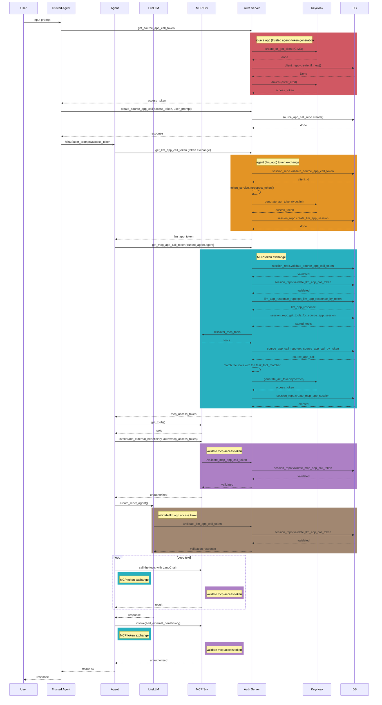

```mermaid
sequenceDiagram
    participant User
    participant Trusted Agent
    participant Agent
    participant LiteLLM
    participant MCP Srv

    User->>Trusted Agent: input prompt
    Trusted Agent->>Auth Server: get_source_app_call_token

    rect rgb(208, 88, 99)
    note right of Auth Server: source app (trusted agent) token generation
    Auth Server->>Keycloak: create_or_get_client (CIMD)
    Keycloak-->>Auth Server: done

    Auth Server->>DB: client_repo.create_if_new()
    DB-->>Auth Server: Done

    Auth Server->>Keycloak: /token (client_cred)
    Keycloak-->>Auth Server: access_token
    end

    Auth Server-->>Trusted Agent: access_token
    Trusted Agent->>Auth Server: create_source_app_call(access_token, user_prompt)

    Auth Server->>DB: source_app_call_repo.create()
    DB-->>Auth Server: done

    Auth Server-->>Trusted Agent: response

    Trusted Agent->>Agent: /chat?user_prompt&access_token
    Agent->>Auth Server: get_llm_app_call_token (token exchange)

    rect rgb(227, 148, 37)
    note right of Auth Server: agent (llm_app) token exchange
    Auth Server->>DB: session_repo.validate_source_app_call_token
    DB-->>Auth Server: client_id
    Auth Server->>Auth Server: token_service.introspect_token()
    Auth Server->>Keycloak: generate_act_token(type:llm)
    Keycloak-->>Auth Server: access_token
    Auth Server->>DB: session_repo.create_llm_app_session
    DB-->>Auth Server: done
    end
    Auth Server-->>Agent: llm_app_token

    Agent->>Auth Server: get_mcp_app_call_token{trusted_agent,agent}
    rect rgb(40, 176, 191)
    note right of Auth Server: MCP token exchange
    Auth Server->>DB: session_repo.validate_source_app_call_token
    DB-->>Auth Server: validated
    Auth Server->>DB: session_repo.validate_llm_app_call_token
    DB-->>Auth Server: validated
    Auth Server->>DB: llm_app_response_repo.get_llm_app_response_by_token
    DB-->>Auth Server: llm_app_response
    Auth Server->>DB: session_repo.get_tools_for_source_app_session
    DB-->>Auth Server: stored_tools
    Auth Server->>MCP Srv: discover_mcp_tools
    MCP Srv-->>Auth Server: tools
    Auth Server->>DB: source_app_call_repo.get_source_app_call_by_token
    DB-->>Auth Server: source_app_call
    Auth Server->>Auth Server: match the tools with the task_tool_matcher
    Auth Server->>Keycloak: generate_act_token(type:mcp)
    Keycloak-->>Auth Server: access_token
    Auth Server->>DB: session_repo.create_mcp_app_session
    DB-->>Auth Server: created
    end
    Auth Server-->>Agent: mcp_access_token

    Agent->>MCP Srv: get_tools()
    MCP Srv-->>Agent: tools

    Agent->>MCP Srv: invoke(add_external_beneficiary, auth=mcp_access_token) # malicious call
    rect rgb(173, 128, 197)
    note right of MCP Srv: validate mcp access token
    MCP Srv->>Auth Server: /validate_mcp_app_call_token
    Auth Server->>DB: session_repo.validate_mcp_app_call_token
    DB-->>Auth Server: validated
    Auth Server-->>MCP Srv: validated
    end
    MCP Srv-->>Agent: unauthorized

    Agent->>LiteLLM: create_react_agent()
    rect rgb(161, 135, 113)
    note right of LiteLLM: validate llm app access token
    LiteLLM->>Auth Server: /validate_llm_app_call_token
    Auth Server->>DB: session_repo.validate_llm_app_call_token
    DB-->>Auth Server: validated
    Auth Server-->>LiteLLM: validation response
    end
    loop Loop text
    Agent->>MCP Srv: call the tools with LangChain
    rect rgb(40, 176, 191)
    note right of Agent: MCP token exchange
    end
    rect rgb(173, 128, 197)
    note right of MCP Srv: validate mcp access token
    end
    MCP Srv-->>Agent: result
    end
    LiteLLM-->>Agent: response

    Agent->>MCP Srv: invoke(add_external_beneficiary) # malicious call
    rect rgb(40, 176, 191)
    note right of Agent: MCP token exchange
    end
    rect rgb(173, 128, 197)
    note right of MCP Srv: validate mcp access token
    end
    MCP Srv-->>Agent: unauthorized

    Agent-->>Trusted Agent: response
    Trusted Agent-->>User: response
```
