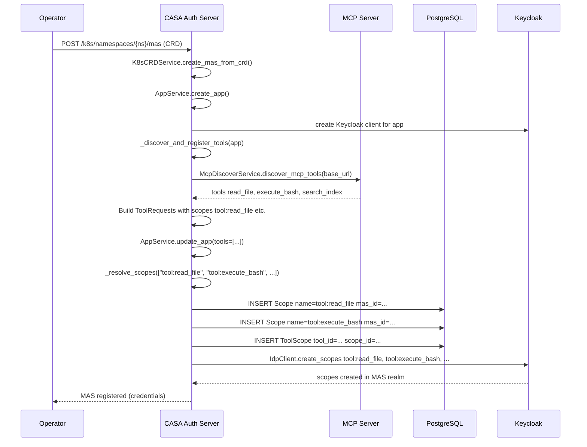
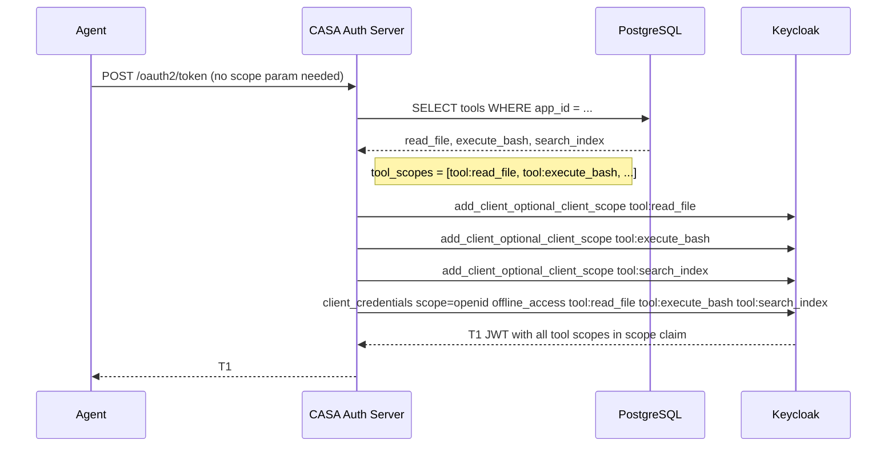
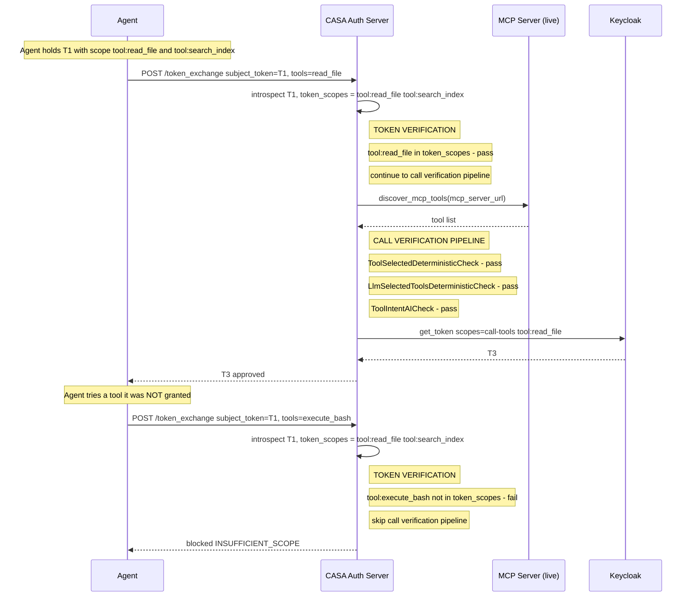

# MCP Tool Token Verification — v1 Architecture Spec

**Status:** Draft  
**Date:** 2026-05-11  
**Audience:** Backend engineers implementing token-based tool authorization on top of MCP tool discovery

---

## 1. Overview

### 1.1 Why Token Verification for Tools

The current CASA deployment auto-discovers MCP tools at CRD registration time and saves them to the `Tool` table. However, discovered tools are **never consulted during authorization decisions**. The three existing call verification checks (deterministic + AI intent) only ask:

> *"Is this tool appropriate for the current task?"*

They never ask:

> *"Does this agent's token grant access to this tool at all?"*

As a result, any agent in a MAS can request any tool on any MCP server, regardless of whether it was ever authorized to do so. The existing `call-tools` scope is coarse-grained — it grants access to every tool on every MCP server, which defeats CASA's least-privilege model.

This spec introduces **fine-grained, per-tool OAuth2 scopes** (`tool:<tool-name>`) that are auto-created at MCP server registration time and verified at every token exchange — **as a token verification step, before the call verification pipeline runs**.

### 1.2 What Changes

| Concern | Current Behavior | After This Spec |
|---|---|---|
| Tool scopes at registration | `Tool.scopes = []` always | Auto-assigned `tool:<name>` scope per tool |
| Keycloak scope catalog | Only `call-tools` exists | `tool:read_file`, `tool:execute_bash`, ... created per MAS |
| `generate_token_oauth` | Calls `get_token(scopes=[])` — always empty | Looks up all tools for the app from DB, auto-builds scope list, no agent config needed |
| `ToolCheckFlags` | No `TOKEN_VERIFICATION` bit | Add `TOKEN_VERIFICATION = 1 << 3`; opt-in per-MAS via CRD |
| Token exchange — token verification | No token verification before checks | When `TOKEN_VERIFICATION` flag set: reject immediately with `INSUFFICIENT_SCOPE` if token lacks required scope |
| T3 approved tool scopes | Only `call-tools` appended | Also appends `tool:<name>` for each approved tool |
| `MCPToolBlockingReason.INSUFFICIENT_SCOPE` | Defined but never emitted | Live, emitted during token verification |

### 1.3 What Does Not Change

- The **existing deterministic and AI-powered tool checks** — `ToolSelectedDeterministicCheck`, `LlmSelectedToolsDeterministicCheck`, `ToolIntentAICheck` — are unchanged
- The **`ToolCheckFactory` and `Payload`** — token verification is not a check; it runs before the factory is invoked
- The **`AppService._resolve_scopes()` method** — already creates `Scope` DB rows; the Keycloak sync is added explicitly in `_discover_and_register_tools` (see section 5.1)
- The **MCP discovery service** (`McpDiscoverService`) — unchanged; only the caller (`_discover_and_register_tools`) adds scope names to the `ToolRequest`
- The **`ToolScope` M2M table** — already exists; this spec populates it for the first time
- **No new REST endpoints, no new DB tables, no new check classes**

---

## 2. Architecture Comparison

### 2.1 Current State

```
CRD registered
  → McpDiscoverService.discover_mcp_tools()   # live MCP SDK call
  → AppService.update_app(tools=[
        ToolRequest(name="read_file", scopes=[]),   ← always empty
        ToolRequest(name="execute_bash", scopes=[]),
    ])
  → Tool rows saved to DB (ToolScope table stays empty)

Token exchange (_process_requested_tools)
  → McpDiscoverService.discover_mcp_tools()   # live re-discovery on every request
  → ToolCheckFactory.get_tool_check(flags)    # DETERMINISTIC + AI only
  → Payload(mcp_server=<live>, ...)
  → checks run → ProcessedTool(blocked=True/False)
  ← INSUFFICIENT_SCOPE never emitted
```

### 2.2 Target State

```
CRD registered
  → McpDiscoverService.discover_mcp_tools()
  → AppService.update_app(tools=[
        ToolRequest(name="read_file",    scopes=["tool:read_file"]),   ← new
        ToolRequest(name="execute_bash", scopes=["tool:execute_bash"]),
    ])
  → Tool rows saved, ToolScope rows created
  → Keycloak: "tool:read_file", "tool:execute_bash" created in MAS realm

T1 issuance (/oauth2/token)
  → generate_token_oauth looks up app.tools from DB
  → builds token_scopes = ["tool:read_file", "tool:execute_bash", ...]  ← automatic
  → get_token(scopes=token_scopes)
  → T1 JWT contains all tool scopes for that MCP server

Token exchange (_process_requested_tools)
  → Extract token_scopes from subject_token.scope JWT claim
  → TOKEN VERIFICATION: for each requested tool
      → "tool:<name>" in token_scopes?
          → NO  → ProcessedTool(blocked, INSUFFICIENT_SCOPE) — skip call verification entirely
          → YES → continue to call verification pipeline
  → ToolCheckFactory.get_tool_check(flags)    # DETERMINISTIC + AI (unchanged)
  → checks run → ProcessedTool(blocked=True/False)
```

---

## 3. Data Model

### 3.1 No New Tables

The `ToolScope` link table already exists in [`core/types.py:43`](../../../src/casa_auth_server/core/types.py):

```python
class ToolScope(SQLModel, table=True):
    tool_id: UUID = Field(foreign_key="tool.id", primary_key=True)
    scope_id: UUID = Field(foreign_key="scope.id", primary_key=True)
```

This spec populates it for the first time via the existing `_resolve_scopes()` path.

### 3.2 Scope Naming Convention

Each MCP tool gets one auto-assigned scope:

```
tool:<tool-name>
```

Examples: `tool:read_file`, `tool:execute_bash`, `tool:search_index`.

Since each MAS has its own Keycloak realm, there is no cross-MAS collision risk with this naming.

Admins can assign additional scopes to a tool via the existing REST API without any changes to the API surface.

---

## 4. How Tool Scopes Are Assigned Automatically

No admin configuration, no Keycloak console, no agent changes. Scopes flow from MCP server → DB → T1 JWT fully automatically.

### 4.1 Registration Creates the Scope Catalog

When an MCP server is registered via CRD, the following happens automatically (see section 6.1 sequence diagram):

1. Tools are discovered from the MCP server
2. Each tool gets a `tool:<name>` scope created in DB and synced to Keycloak
3. The `ToolScope` link table maps each `Tool` row to its `Scope` row

The MCP server itself is the authority — whatever tools it advertises, those become the scopes. No human decision required.

### 4.2 T1 Scopes Are Auto-Loaded from the Tool Catalog

When an agent calls `/oauth2/token`, `generate_token_oauth` looks up all tools registered for that app in the DB and builds the scope list automatically:

```python
tool_scopes = [f"tool:{tool.name}" for tool in app.tools]
# e.g. ["tool:read_file", "tool:execute_bash", "tool:search_index"]
```

`get_token()` assigns these as optional scopes on the Keycloak client and requests the token — T1 comes back with all tool scopes in the JWT `scope` claim. The agent does not need to know about scopes, request them, or configure anything.

### 4.3 Scope Availability Precondition

For Keycloak to include a scope in T1, the scope must already exist in the MAS realm. This is guaranteed by the registration flow in section 6.1 — `_discover_and_register_tools` calls `idp_client.create_scopes()` after `update_app()`, so all `tool:<name>` scopes are in Keycloak before the CRD registration response is returned to the operator. By the time any agent requests T1, the scope catalog is already populated.

---

## 5. Implementation

### 5.1 Auto-assign Scopes During Tool Discovery

**File:** [`k8s/k8s_crd_service.py`](../../../src/casa_auth_server/k8s/k8s_crd_service.py) — `_discover_and_register_tools()` (line 187)

Populate `ToolRequest.scopes` with the auto-derived scope name for each discovered tool:

```python
tool_requests = [
    ToolRequest(
        name=tool.name,
        description=tool.description or "",
        input_schema=json.dumps(tool.inputSchema),
        output_schema=json.dumps(tool.outputSchema) if tool.outputSchema else "{}",
        scopes=[f"tool:{tool.name}"],   # auto-assign scope
    )
    for tool in mcp_server.tools
]
```

`AppService._resolve_scopes()` creates `Scope` DB rows and the `ToolScope` link rows. However, it does **not** sync the new scopes to Keycloak — that call is missing. Without the Keycloak sync, `get_token()` will call `get_client_scope_by_name()`, find nothing, silently drop the scope, and T1 will not carry the tool scopes.

**Fix:** after `_resolve_scopes()` returns, call `idp_client.create_scopes()` with the new scope names:

```python
scope_names = [f"tool:{tool.name}" for tool in mcp_server.tools]
app_service.update_app(app_id, AppRequest(..., tools=tool_requests))

# Sync tool scopes to Keycloak so get_token() can find them
idp_client.create_scopes(mas.authorization_server, scope_names)
```

`create_scopes()` is idempotent — it skips scopes that already exist in the realm.

### 5.2 Token Issuance and Exchange Changes

Two changes are needed in [`services/authorization_server.py`](../../../src/casa_auth_server/services/authorization_server.py). No route changes, no `TokenRequest` model changes, no agent changes.

#### 5.2.1 Auto-load tool scopes in `generate_token_oauth`

**File:** `authorization_server.py` — `generate_token_oauth()` (line 165)

Currently calls `get_token(scopes=[])` — always empty. Instead, look up all tools registered for the app in the DB and derive the scope list automatically:

```python
tool_scopes = [f"tool:{tool.name}" for tool in app.tools]

token_payload = self.idp_client.get_token(
    app.mas.authorization_server,
    client_creds=ClientCredentials(client_id=request.client_id, client_secret=request.client_secret),
    sub=request.client_id,
    act=None,
    scopes=tool_scopes,   # was hardcoded []
    extra={},
    user_input_id=str(user_input.id),
)
```

`app.tools` is already loaded via the `App → Tool` relationship. `get_token()` assigns each scope as an optional scope on the Keycloak client and requests the token — T1 comes back with all tool scopes in the JWT `scope` claim. The agent does not need to know about scopes or request them explicitly.

#### 5.2.2 Token verification before the call verification pipeline

**File:** `authorization_server.py` — `_process_requested_tools()` (line 271)

This is the core of this spec. Token verification is **not** a check — it runs before the call verification pipeline. If the agent's token does not carry the required scope for a tool, that tool is rejected immediately and the deterministic/AI call verification checks are never run.

```python
token_scopes = subject_token.scope.split() if subject_token.scope else []

for tool in list(set(request.tools)):
    processed_tool = ProcessedTool(name=tool)
    processed_tools.append(processed_tool)

    # Token verification: only active when TOKEN_VERIFICATION flag is set (opt-in, see section 7.2)
    if (tool_check_flags & ToolCheckFlags.TOKEN_VERIFICATION) and f"tool:{tool}" not in token_scopes:
        processed_tool.blocked = True
        processed_tool.blocking_type = MCPToolBlockingType.DETERMINISTIC
        processed_tool.blocking_reason = MCPToolBlockingReason.INSUFFICIENT_SCOPE
        continue   # skip call verification pipeline entirely

    # Call verification runs only for tools the agent is authorized to call
    tool_check = self.tool_check_factory.get_tool_check(tool_check_flags)
    check_result = tool_check.is_satisfied(
        payload=Payload(
            llm_selected_tools=llm_selected_tools,
            requested_tool=tool,
            mcp_server=mcp_server,
            user_input=user_input,
        )
    )
    ...
```

#### 5.2.3 Append approved tool scopes to T3

**File:** `authorization_server.py` — `exchange_token()` (line 219)

When tools are approved, T3 currently only gets `call-tools`. Also append the per-tool scopes so T3 carries the full scope evidence:

```python
if approved_tools:
    scopes.append("call-tools")
    scopes += [f"tool:{t}" for t in approved_tools]   # new
```

---

## 6. Full Sequence Diagrams

### 6.1 Registration: Tool Discovery → Scope Creation



### 6.2 Initial Token Issuance: Automatic Tool Scope Loading



### 6.3 Token Exchange: Token Verification then Call Verification



---

## 7. Key Design Decisions

### 7.1 Token Verification is Separate from Call Verification

Token verification deliberately sits **outside** the `ToolCheckFactory` pipeline. The deterministic and AI call verification checks verify runtime behavior — did the LLM select this tool, does it match the user's intent, did the agent tamper with tool definitions. These are questions about what happened during the agent's execution.

Token verification is a different concern: does the agent's token grant access to this tool at all? This is answered entirely from the JWT — no live MCP call, no LLM, no trace lookup. If the answer is no, running the call verification pipeline is pointless and wasteful. The `continue` after token verification ensures the call verification checks are only reached for tools the agent was legitimately granted access to.

### 7.2 Default-on vs. Opt-in Discussion

This is the most impactful deployment decision for this feature.

**Arguments for default-on:**

- Default-on is the correct security posture for a zero-trust system — least privilege should be the starting state, not an opt-in upgrade
- New MAS deployments get the right behavior without manual configuration
- Forces the scope assignment UX to be complete before shipping, rather than deferring it

**Arguments for opt-in (off by default):**

- Existing deployments that have no tools registered will have T1 issued with an empty tool scope list — token verification will then block every tool call until tools are discovered and registered
- Demo flows and integration tests need to seed tool registration before token verification can be enabled
- If an MCP server is temporarily unreachable at registration time, its tools won't be discovered and the scope catalog will be incomplete

**Recommendation: opt-in for v1, default-on for v2**

Token verification is gated by a new `TOKEN_VERIFICATION` bit in `ToolCheckFlags`:

```python
class ToolCheckFlags(IntFlag):
    NONE = 0
    DETERMINISTIC_TOOL_SELECTED     = 1 << 0
    DETERMINISTIC_LLM_SELECTED_TOOLS = 1 << 1
    AI_POWERED_TOOL_MATCH           = 1 << 2
    TOKEN_VERIFICATION              = 1 << 3   # new
```

The token verification block in `_process_requested_tools` is only entered when this flag is set:

```python
token_scopes = subject_token.scope.split() if subject_token.scope else []

for tool in list(set(request.tools)):
    processed_tool = ProcessedTool(name=tool)
    processed_tools.append(processed_tool)

    # Token verification gate — only active when flag is set
    if (tool_check_flags & ToolCheckFlags.TOKEN_VERIFICATION) and f"tool:{tool}" not in token_scopes:
        processed_tool.blocked = True
        processed_tool.blocking_type = MCPToolBlockingType.DETERMINISTIC
        processed_tool.blocking_reason = MCPToolBlockingReason.INSUFFICIENT_SCOPE
        continue
    ...
```

The default `enabled_tool_checks` on `MultiAgentSystem` does **not** include `TOKEN_VERIFICATION` in v1. Operators opt in per-MAS via the CRD `enabledToolChecks` field. Once all demo/integration flows have tool registration wired up and verified, add `TOKEN_VERIFICATION` to the default mask for v2. The migration is low-friction — no agent changes, no Keycloak console. The only prerequisite is that MCP servers are reachable at CRD registration time so tool discovery succeeds.

### 7.3 Per-Tool Scopes vs. Single `call-tools` Scope

The existing `call-tools` scope is all-or-nothing — it grants access to every tool on every MCP server. With `tool:<name>` scopes, a token can carry `tool:read_file tool:search_index` but not `tool:execute_bash`. The token literally cannot be upgraded to include `execute_bash` unless that scope was pre-authorized in Keycloak. This is the least-privilege boundary CASA is designed to enforce.

### 7.4 JWT Claim as Runtime Authority

Token verification reads `token_scopes` from the subject token's JWT `scope` claim — it does not query the `ToolScope` DB table at runtime. The DB mapping is the **registration-time configuration** (what scopes a tool requires); the Keycloak-issued JWT is the **runtime assertion** (what scopes the agent holds). Separating these concerns keeps the token verification path fast and stateless.

### 7.5 Scope Re-registration on Tool Refresh

`AppService.update_app()` currently replaces all `app.tools` completely. When `_discover_and_register_tools` is eventually extended to support tool refresh (e.g., on operator reconcile), `update_app()` will re-run `_resolve_scopes()` (idempotent for DB rows) and `idp_client.create_scopes()` (idempotent for Keycloak) — existing scopes are reused, new ones are created. Manually-added extra scopes on a tool will be lost on refresh unless `ToolRequest.scopes` is rebuilt to include them; this is a known limitation to address in a future iteration.

Token verification at exchange time will always reflect the current state of the JWT — if a tool's scope is removed from Keycloak and the agent's token no longer carries it, access is denied on the next exchange without any service restart.

---

## 8. Summary of Changes by Component

| Component | File | Change Type | Description |
|---|---|---|---|
| **Auth Server** | `k8s/k8s_crd_service.py` | Logic change | Populate `ToolRequest.scopes=["tool:<name>"]` during discovery + call `idp_client.create_scopes()` to sync to Keycloak |
| **Auth Server** | `services/authorization_server.py` — `generate_token_oauth` | Logic change | Auto-load tool scopes from `app.tools` DB relationship, pass to `get_token()` |
| **Auth Server** | `services/authorization_server.py` — `_process_requested_tools` | Logic change | Token verification: reject tools missing required scope before call verification pipeline |
| **Auth Server** | `services/authorization_server.py` — `exchange_token` | Logic change | Append `tool:<name>` scopes to T3 for each approved tool |
| **Auth Server** | `core/types.py` — `ToolCheckFlags` | Model change | Add `TOKEN_VERIFICATION = 1 << 3` flag (not in default mask for v1) |
| **Auth Server** | `database/migrations/` | Migration | Alembic migration only if default `enabled_tool_checks` changes |

No new check classes. No changes to `ToolCheckFactory`, `Payload`, `checks/`, `TokenRequest`, or any route. No new REST endpoints. No new DB tables. No agent changes.
