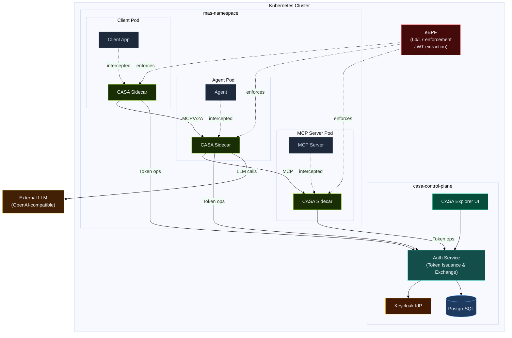

# Architecture Overview

CASA has two main layers: a **control plane** that manages identity and policy, and a **data plane** that enforces those policies at runtime.

## Global Architecture

### Components

## Component Summary

### Control Plane

The control plane runs in the `casa-control-plane` namespace and handles:

- **Token issuance** — OAuth2 client credentials flow (initial token for user input)
- **Token exchange** — RFC 8693 token exchange for delegated, scope-limited tokens
- **Token introspection** — validates tokens presented by sidecars
- **Tool check orchestration** — runs deterministic and/or AI-powered checks on token exchange requests
- **MAS lifecycle management** — reads `MultiAgentSystem` and `CASAPolicy` CRDs, reconciles application state

See [Control Plane](control-plane.md) for full details.

### CASA Sidecar

Every pod in a CASA-managed namespace gets an Envoy-based sidecar injected automatically. The sidecar:

- Intercepts all inbound and outbound HTTP traffic via iptables rules
- On **egress**: requests or exchanges tokens, injects `Authorization` header
- On **ingress**: introspects presented tokens, allows or denies the request
- Caches introspection results (30s TTL) to reduce control plane load
- Enforces protocol restrictions (MCP, A2A only — no arbitrary HTTP)

See [CASA Sidecar](sidecar.md) for full details.

### eBPF Enforcement Layer

The eBPF enforcement layer operates at the kernel level on eBPF-enabled Kubernetes nodes (kernel 5.8+), independently of the CNI. It provides:

- **Deny-by-default** — traffic enforcement via eBPF programs or network policy
- **LLM endpoint restriction** — agents can only reach a single approved external FQDN
- **JWT extraction** — eBPF programs extract and hash JWTs from HTTP headers for observability
- **Flow logging** — real-time flow logs correlated with token metadata

In Istio mode, eBPF enforcement uses the node kernel and is available when nodes have eBPF enabled. The [Cilium deployment mode](/deployment-modes/cilium) (roadmap) provides a fully integrated eBPF + sidecar solution via the Cilium daemonset.

See [eBPF Enforcement](ebpf.md) for full details.

## Deployment Modes

CASA supports two dataplane options:

| Mode | Sidecar Injection | L7 Enforcement | L4/L7 + eBPF | Status |
|---|---|---|---|---|
| **Istio** | Istio automatic injection | `ext_authz_middleware` (Go) | eBPF (node kernel) | Current |
| **Cilium** | Node-level daemonset | CASA sidecar (Envoy + Lua) | CASAPolicy + eBPF (integrated) | Coming soon (Roadmap) |

See [Deployment Modes](/deployment-modes/istio) for setup guides.

## Trust Model

CASA operates on a layered trust model:

1. **eBPF / L4-L7** — deny by default; only known endpoints may communicate
2. **Sidecar / L7** — every request must carry a valid, non-expired token with correct scope
3. **Control plane** — token exchange validates that the requested tool matches the original user intent

No layer alone is sufficient. Compromise requires breaking all three.
