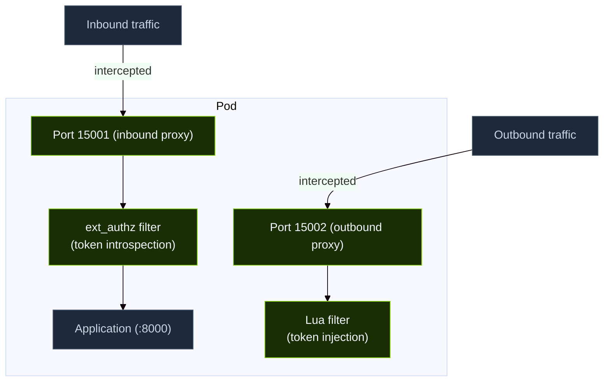

# CASA Sidecar

The CASA sidecar is an Envoy-based proxy that is automatically injected into every pod in a CASA-managed namespace. It is the primary enforcement point for token validation and protocol restriction at L7.

## Injection

Sidecars are injected either by:

- **Istio mode**: namespace label `istio-injection=enabled` triggers Istio's built-in sidecar injector. The `ext_authz_middleware` service (deployed separately) acts as the ext-authz filter backend.
- **Cilium mode** *(coming soon)*: a CASA node-level daemonset (deployed via Cilium) intercepts pod traffic without per-pod injection — no mutating webhook required.

An init container runs first to configure iptables rules that redirect all inbound and outbound TCP traffic through the sidecar ports.

## Traffic Interception

**Inbound path (port 15001):**
1. All incoming requests are intercepted
2. The `ext_authz` filter calls the control plane to introspect the token in the `Authorization` header
3. If the token is valid and scoped correctly: forward to the application
4. If invalid or absent: return 403, fail closed

**Outbound path (port 15002):**
1. All outgoing requests are intercepted
2. The Lua filter checks if a valid cached token exists
3. If not, it requests a token exchange from the control plane
4. Injects the token as `Authorization: Bearer <token>`
5. Enforces protocol restrictions (only MCP/A2A paths are allowed)

## Token Caching

Introspection results are cached locally for 30 seconds. This means:
- Reduced load on the control plane during normal operation
- If the control plane becomes unreachable, cached results continue to work for up to 30 seconds
- After cache expiry, the sidecar **fails closed** — all requests are denied until the control plane recovers

## Protocol Enforcement

The sidecar enforces that agents only use allowed protocols:

| App type | Allowed outbound protocols |
|---|---|
| `agent` | MCP, A2A |
| `mcp_server` | (inbound MCP only) |
| `client` | MCP, A2A |

Requests to paths that do not match allowed protocol patterns are rejected with a 403 before the control plane is consulted.

## Istio ext-authz Middleware

In Istio mode, the external authorization check is handled by the `ext_authz_middleware` — a Go gRPC service bundled in the `casa-control-plane` Helm chart. It:

1. Receives authorization check requests from Envoy's ext_authz filter
2. Extracts the trace ID from the `traceparent` header (W3C trace context)
3. On the first request in a trace: generates a new user input token by calling the auth service
4. On subsequent requests: performs token-based access control (TBAC) verification
5. Returns ALLOW or DENY to Envoy

Telemetry and traces are visible in the **CASA Explorer UI**.
