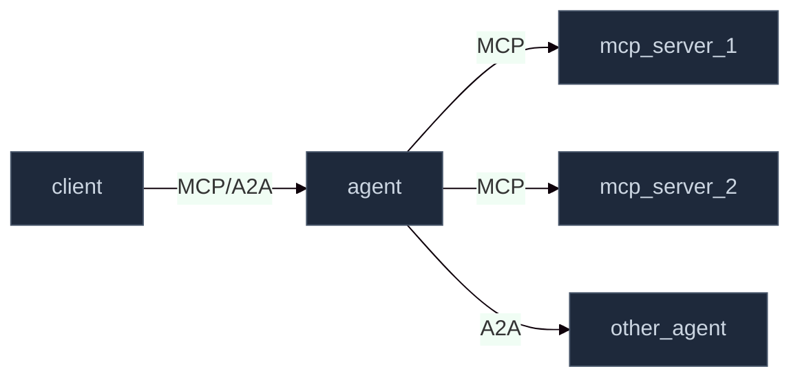

# Multi-Agent Systems

A **Multi-Agent System (MAS)** in CASA is a named, namespaced group of applications that collaborate to fulfill user requests. CASA treats the MAS as the unit of policy configuration — you declare what applications are in the system and what rules apply, and CASA enforces them.

## Application Types

Every application in a MAS has one of three types:

| Type | Description | Allowed outbound protocols |
|---|---|---|
| `agent` | An AI agent that calls LLMs, tools, and other agents | MCP, A2A |
| `mcp_server` | A Model Context Protocol server that exposes tools | (receives MCP only) |
| `client` | A user-facing application or trusted caller | MCP, A2A |

## MAS Topology

A typical MAS looks like this:



All inter-application communication is intercepted by CASA sidecars, which:
1. Inject tokens on outbound requests
2. Validate tokens on inbound requests
3. Enforce that only allowed protocol paths are used

## MAS Configuration via CRD

You declare a MAS using the `MultiAgentSystem` CRD. CASA reads this and automatically:
- Registers the applications in the auth service
- Configures token issuance scopes per application
- Applies the declared `enabledToolChecks` to all token exchange requests within the MAS

Example:

```yaml
apiVersion: casa.io/v1alpha1
kind: MultiAgentSystem
metadata:
  name: my-mas
  namespace: my-mas
spec:
  name: "My Multi-Agent System"
  authorizationServer: "my-mas-realm"
  enabledToolChecks:
  - DETERMINISTIC_TOOL_SELECTED
  - DETERMINISTIC_LLM_SELECTED_TOOLS
  apps:
  - name: my-client
    type: client
    baseUrl: "http://my-client.my-mas.svc.cluster.local:8000"
  - name: my-agent
    type: agent
    baseUrl: "http://my-agent.my-mas.svc.cluster.local:8000"
  - name: my-mcp-server
    type: mcp_server
    baseUrl: "http://my-mcp-server.my-mas.svc.cluster.local:8080"
```

See [CRDs Reference](/configuration/crds-reference) for all available fields.

## No Code Changes Required

MAS applications do not need to import any CASA SDK or call any CASA API directly. The sidecar handles all token operations transparently:

- When your agent makes an HTTP request to an MCP server, the sidecar intercepts it, exchanges a token, and adds the `Authorization` header before forwarding
- When your MCP server receives a request, the sidecar validates the token before the request reaches the application

Your application code is unaware of CASA.

## Multiple MAS in One Cluster

A single CASA control plane can manage multiple MAS deployments, each in its own namespace. Policies are namespace-scoped — one MAS cannot access another MAS's tokens or tools without an explicit cross-namespace policy.
