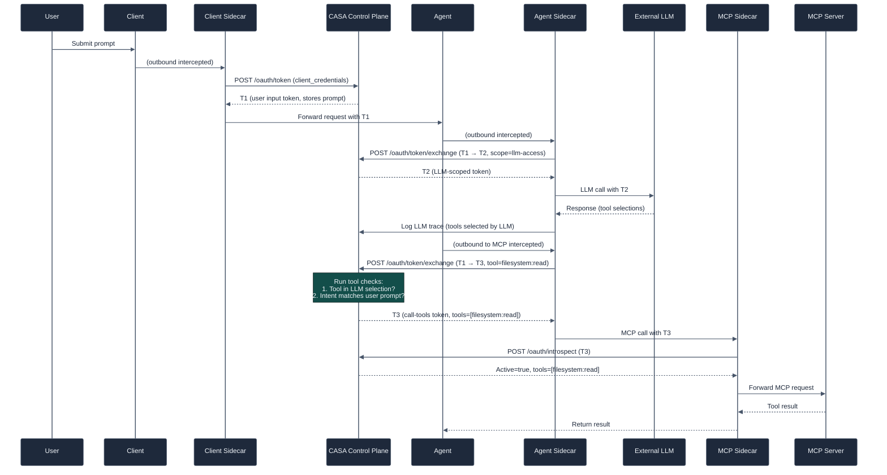

# Token Flow

CASA uses OAuth2 token exchange (RFC 8693) to create a chain of trust from user intent to tool execution. Every token is scoped to a specific purpose, and each exchange requires the previous token to be valid.

## Token Types

| Token | Scope | Issued when | Used for |
|---|---|---|---|
| **T1 (user input token)** | `user-input` | User submits a prompt | Proves origin and user intent |
| **T2 (LLM token)** | `llm-access` | Agent exchanges T1 | Authorizes LLM calls |
| **T3 (tool token)** | `call-tools` + specific tools | Agent exchanges T1 after LLM selects tools | Authorizes MCP tool calls |

Tokens are short-lived (5-minute TTL) and are single-purpose — a T2 LLM token cannot be used to call MCP tools.

## Full Token Exchange Sequence

## What Happens When a Check Fails

If a tool check fails during token exchange (step where Agent requests T3):

1. CASA returns a 403 Forbidden response
2. The sidecar logs the denial with the tool name and check that failed
3. The agent receives a 403 and cannot call the tool
4. The event is recorded in telemetry for audit purposes

The user's prompt and the agent's tool selection are both recorded, so you can see exactly why a denial occurred.

## Token Exchange vs Token Introspection

**Token exchange** (`/oauth/token/exchange`):
- Called by sidecars on egress (when making outbound calls)
- Runs all configured tool checks
- Returns a new, narrower-scoped token

**Token introspection** (`/oauth/introspect`):
- Called by sidecars on ingress (when receiving inbound calls)
- Validates the presented token and returns its claims
- No tool checks — validation only

## Sidecar Transparency

Applications are not aware of token operations. The sidecar handles everything:

- On egress: intercepts the request, performs the token exchange, injects the token, forwards
- On ingress: intercepts the request, introspects the token, allows or denies

Your application code never sees tokens, never calls the control plane, and never needs to handle auth errors from CASA.
