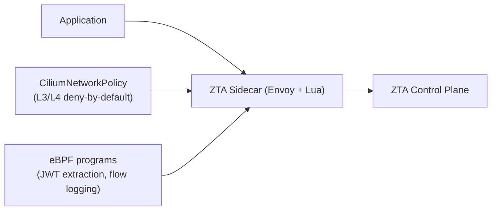

:::caution Coming Soon
Cilium deployment mode is **not yet available**. This page describes the planned architecture and will be updated when Cilium support ships. For the current supported setup, see [Istio Deployment Mode](istio.md).
:::

# Cilium Deployment Mode

In Cilium mode, ZTA uses a custom mutating webhook for sidecar injection and Cilium for both L3/L4 network enforcement and eBPF-based observability.

This is the **planned production architecture** (currently in development).

## How It Works



1. The ZTA mutating webhook injects a custom Envoy sidecar into pods in labeled namespaces
2. Cilium enforces L3/L4 policies (deny-by-default; only declared endpoints may communicate)
3. The ZTA sidecar handles L7 enforcement: token injection, token introspection, protocol enforcement
4. Custom eBPF programs extract JWTs from HTTP headers for observability

## Prerequisites

- Cilium 1.14+ installed in your cluster
- ZTA control plane installed
- ZTA mutating webhook deployed (part of the control plane chart — enable via values)

## Step 1: Label the Namespace

Enable ZTA sidecar injection for your MAS namespace:

```bash
kubectl label namespace your-mas-namespace zta.io/injection=enabled
```

## Step 2: Apply Network Policies

Apply deny-by-default and allow-list policies for your MAS namespace.

**Deny all (default):**

```yaml
apiVersion: cilium.io/v2
kind: CiliumNetworkPolicy
metadata:
  name: default-deny-all
  namespace: your-mas-namespace
spec:
  endpointSelector: {}
  ingress: []
  egress: []
```

**Allow agent → control plane (token operations):**

```yaml
apiVersion: cilium.io/v2
kind: CiliumNetworkPolicy
metadata:
  name: mas-to-control-plane
  namespace: your-mas-namespace
spec:
  endpointSelector:
    matchLabels:
      zta.io/enabled: "true"
  egress:
  - toEndpoints:
    - matchLabels:
        app: zta-auth-service
        io.kubernetes.pod.namespace: zta-control-plane
    toPorts:
    - ports:
      - port: "8443"
        protocol: TCP
```

**Allow agent → MCP server:**

```yaml
apiVersion: cilium.io/v2
kind: CiliumNetworkPolicy
metadata:
  name: agent-to-mcp
  namespace: your-mas-namespace
spec:
  endpointSelector:
    matchLabels:
      app: my-agent
  egress:
  - toEndpoints:
    - matchLabels:
        app: my-mcp-server
    toPorts:
    - ports:
      - port: "8080"
        protocol: TCP
      rules:
        http:
        - method: "POST"
          path: "/mcp/*"
        - method: "GET"
          path: "/mcp/*"
```

**Allow agent → external LLM:**

```yaml
apiVersion: cilium.io/v2
kind: CiliumNetworkPolicy
metadata:
  name: agent-to-llm
  namespace: your-mas-namespace
spec:
  endpointSelector:
    matchLabels:
      app: my-agent
  egress:
  - toFQDNs:
    - matchPattern: "api.openai.com"
    toPorts:
    - ports:
      - port: "443"
        protocol: TCP
```

## Step 3: Apply ZTAPolicy CRDs (Recommended)

Instead of writing `CiliumNetworkPolicy` manually, use `ZTAPolicy` CRDs and let the ZTA operator generate them:

```yaml
apiVersion: zta.io/v1alpha1
kind: ZTAPolicy
metadata:
  name: agent-policy
  namespace: your-mas-namespace
spec:
  targetRef:
    kind: Deployment
    name: my-agent
  allowedProtocols:
  - mcp
  - a2a
  allowedEndpoints:
  - name: my-mcp-server
    namespace: your-mas-namespace
    port: 8080
  - name: zta-auth-service
    namespace: zta-control-plane
    port: 8443
  llmEndpoint:
    fqdn: api.openai.com
    port: 443
```

## Step 4: Verify

Check that Cilium policies are in effect:

```bash
# List Cilium network policies
kubectl get ciliumnetworkpolicy -n your-mas-namespace

# Check Hubble flow logs
cilium hubble observe --namespace your-mas-namespace

# Verify an agent cannot reach an unlisted endpoint
kubectl exec -n your-mas-namespace deploy/my-agent -- curl -s https://api.anthropic.com/
# Expected: connection refused / timeout (blocked by Cilium)
```

## eBPF JWT Observability

To enable JWT extraction and flow logging with custom eBPF programs, refer to `contrib/wip/it1/SPECS.md` Section 5.5 for implementation details. This feature is currently in an experimental state and not yet bundled in the Helm chart.

## Hubble for Flow Visibility

```bash
# Enable Hubble UI
cilium hubble enable --ui

# Port-forward and open in browser
cilium hubble ui
```

Hubble provides:
- Real-time flow logs per pod
- Policy verdict (ALLOWED / DENIED) per connection
- L7 HTTP visibility (method, path, status code)

## Next Steps

- [Configuration — CRDs Reference](/configuration/crds-reference) — full ZTAPolicy field reference
- [Architecture — eBPF Enforcement](/architecture/ebpf) — deep dive on the eBPF layer
