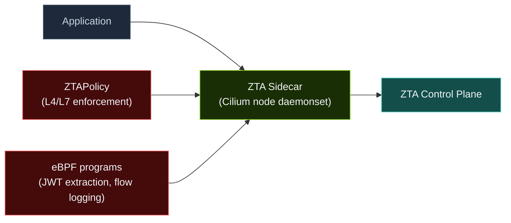

:::caution Coming Soon
Cilium deployment mode is **not yet available**. This page describes the planned architecture and will be updated when Cilium support ships. For the current supported setup, see [Istio Deployment Mode](istio.md).
:::

# Cilium Deployment Mode

In Cilium mode, ZTA uses Cilium's node-level daemonset for both sidecar traffic interception and eBPF enforcement — no per-pod injection webhook is needed.

This is the **planned production architecture**, architecturally equivalent to Istio + eBPF but with tighter Cilium integration. Observability is provided by the **ZTA Explorer UI** in both modes.

## How It Works



1. The Cilium node-level daemonset intercepts pod traffic cluster-wide — no per-pod sidecar injection required
2. Cilium enforces L4/L7 policies (deny-by-default; only declared endpoints may communicate)
3. The ZTA sidecar handles L7 enforcement: token injection, token introspection, protocol enforcement
4. Custom eBPF programs extract JWTs from HTTP headers for observability

## Prerequisites

- Cilium 1.14+ installed in your cluster
- ZTA control plane installed via the `zta-control-plane` Helm chart (includes all ZTA components and subcharts)

## Step 1: Label the Namespace

Enable ZTA sidecar injection for your MAS namespace:

```bash
kubectl label namespace your-mas-namespace zta.io/injection=enabled
```

## Step 2: Declare Network Policies via ZTAPolicy

:::caution In Development
`ZTAPolicy` is currently in development. When available, it will automatically manage network enforcement policies for your MAS workloads. See [Concepts — CRDs](/concepts/crds) for the full field reference.
:::

Network policies for your MAS are declared using `ZTAPolicy` CRDs. Example:

```yaml
apiVersion: zta.io/v1alpha1
kind: ZTAPolicy
metadata:
  name: agent-policy
  namespace: your-mas-namespace
spec:
  targetRef:
    kind: Deployment
    name: my-agent
  allowedProtocols:
  - mcp
  - a2a
  allowedEndpoints:
  - name: my-mcp-server
    namespace: your-mas-namespace
    port: 8080
  - name: zta-auth-service
    namespace: zta-control-plane
    port: 8443
  llmEndpoint:
    fqdn: api.openai.com
    port: 443
```

## Step 3: Verify ZTAPolicy Status

Once `ZTAPolicy` support ships, check that policies have been applied:

```bash
# List ZTA policies in the namespace
kubectl get ztap -n your-mas-namespace

# Describe a specific policy
kubectl describe ztap agent-policy -n your-mas-namespace
```

## Step 4: Verify

```bash
# Verify an agent cannot reach an unlisted endpoint
kubectl exec -n your-mas-namespace deploy/my-agent -- curl -s https://api.anthropic.com/
# Expected: connection refused / timeout (blocked by eBPF enforcement)
```

## Observability

Token events, tool check decisions, and flow verdicts are visible in the **ZTA Explorer UI**:

```bash
kubectl -n zta-control-plane port-forward svc/zta-ui-explorer 8080:80
# Open http://localhost:8080
```

## eBPF JWT Observability

JWT extraction and flow logging with custom eBPF programs is described in `contrib/wip/it1/SPECS.md` Section 5.5. This feature is currently experimental and will be bundled in a future chart version.

## Next Steps

- [Configuration — CRDs Reference](/configuration/crds-reference) — full ZTAPolicy field reference
- [Architecture — eBPF Enforcement](/architecture/ebpf) — deep dive on the eBPF layer
