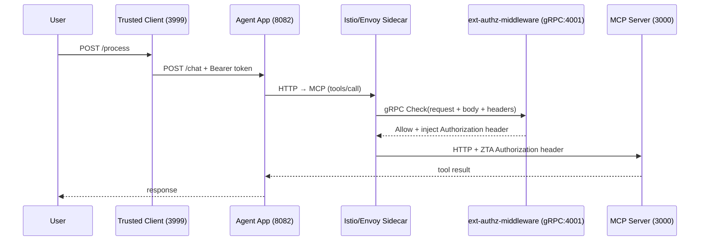
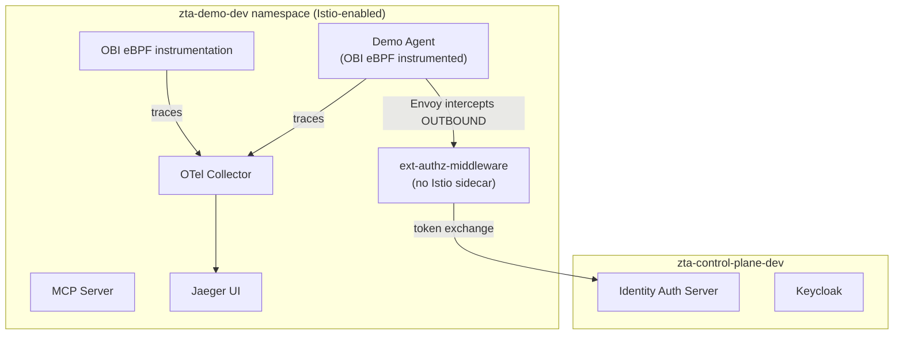

# Architecture

## Request flow

```mermaid
sequenceDiagram
    participant User
    participant Source as Trusted Client (3999)
    participant Agent as Agent App (8082)
    participant Envoy as Istio/Envoy Sidecar
    participant ExtAuthz as ext-authz-middleware (gRPC:4001)
    participant MCP as MCP Server (3000)

    User->>Source: POST /process
    Source->>Agent: POST /chat + Bearer token
    Agent->>Envoy: HTTP → MCP (tools/call)
    Envoy->>ExtAuthz: gRPC Check(request + body + headers)
    ExtAuthz-->>Envoy: Allow + inject Authorization header
    Envoy->>MCP: HTTP + ZTA Authorization header
    MCP-->>Agent: tool result
    Agent-->>User: response
```

## Deployment topology

```mermaid
graph TD
    subgraph zta-demo-dev["zta-demo-dev namespace (Istio-enabled)"]
        Agent["Demo Agent\n(OBI eBPF instrumented)"]
        MCP[MCP Server]
        ExtAuthz["ext-authz-middleware\n(no Istio sidecar)"]
        OBI[OBI eBPF instrumentation]
        OTel[OTel Collector]
        Jaeger[Jaeger UI]
    end
    subgraph zta-control-plane-dev[zta-control-plane-dev]
        AuthServer[Identity Auth Server]
        KC[Keycloak]
    end

    Agent -->|Envoy intercepts OUTBOUND| ExtAuthz
    ExtAuthz -->|token exchange| AuthServer
    OBI -->|traces| OTel
    Agent -->|traces| OTel
    OTel --> Jaeger
```
